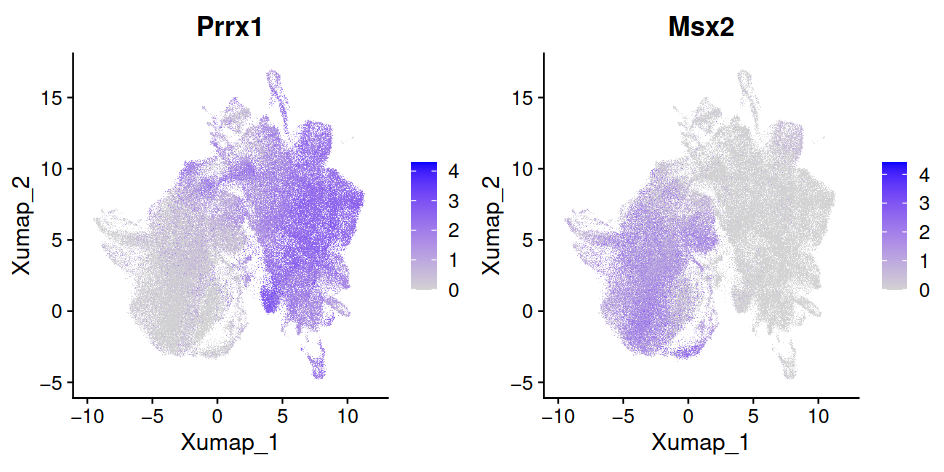

# Level 1 Annotation

## Motivation
In level 1 annotation, we devided the mesenchyme into two main groups. We are surprised to find that these two clusters are closely associated with ages.

Therefore, we named these two clusters as `Embryonic Mesenchyme` and `Postnatal Mesenchyme`.

## Embryonic Mesenchyme
The embryonic mesenchyme originates from cranial neural crest cells (CNCCs). After migrating into the oral region of the first pharyngeal arch, these postmigratory CNCCs commit to the dental mesenchymal lineage {cite:p}`jingSpatiotemporalSinglecellRegulatory2022`.

## Postnatal Mesenchyme
The postnatal mesenchyme includes dentin-producing odontoblasts, the pulp, and the dental follicle {cite:p}`fresiaBiteByteDental2021`.

The marker genes between these two groups are different. The typical markers of embryonic mesenchyme genes are highly expressed in Embryonic Mesenchyme, such as Prrx1 {cite:p}`hanTrajectorycentricFrameworkTrajAtlas2024`. And marker genes of dental msenchyme stem cells are highly expressed in Postnatal Mesenchyme, such as Msx2 {cite:p}`zhengSinglecellRNAseqAnalysis2024` .

