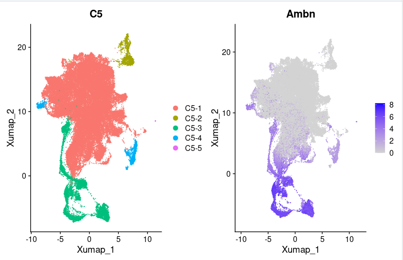
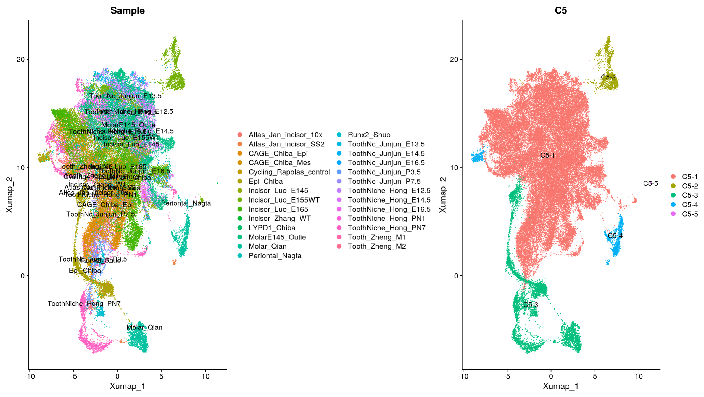

# Epithelium Level 1 Annotation

## Motivation
In level 1 annotation, we devided the epithelium into two major clusters and other low quality clusters. Base on ameloblast markers, these two clusters can be annotated as ameloblasts, Non-ameloblasts.

## Ameloblast and Non-ameloblast
These clusters can be devided by ameloblast markers [*Ambn*](https://www.ncbi.nlm.nih.gov/gene/258).

## Low quality clusters
C5-2, C5-4 samples are too homogeneous. And C5-5 subcluster is too small (located in the middle of the far right side of the figure)

