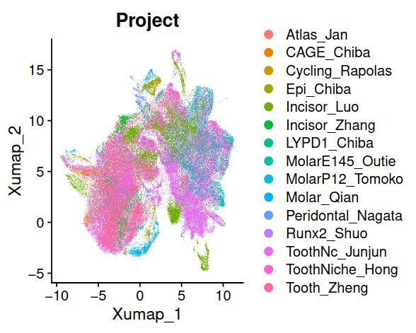

# Level 2 annotation

## Motivation
In level 2 annotation, we devided the mesenchyme into 9 clusters, including four large populations ("C9-1","C9-2","C9-6","C9-7") and five small populations. In this level, we want to assign the consensus annotation from literature to these clusters.

Here is a summary of the annotation of each cluster:

## Bud Mesenchyme & Cap Mesenchyme

In the study focused on tooth germ development {cite:p}`wangSingleCellAtlas2022` {cite:p}`jingSpatiotemporalSinglecellRegulatory2022`, the data reveal significant heterogeneity among the datasets at different stages, such as the bud stage and cap stage. We have also observed that the thickening stage mesenchyme (< E13.5) and bud stage (E13.5-E14.5) (See [Metadata Collection](../preprocess/metadata_process.md)) are predominantly present in the C9-1 cluster. The C9-2 cluster is primarily composed of mesenchyme at the cap stage (E14.5-E18.5). Therefore, we assigned the C9-1 cluster as "Bud Mesenchyme" and the C9-2 cluster as "Cap Mesenchyme".

Bud mesenchyme highly expressed the genes related to embroyic develpment, such as [Tbx18](https://www.genecards.org/cgi-bin/carddisp.pl?gene=tbx18) and [Hic1](https://www.genecards.org/cgi-bin/carddisp.pl?gene=hic1) {cite:p}`arosteguiCellularTaxonomyHic12022`.

Cap mesenchyme exhibits notable differentiation potential. We observed that genes associated with dental follicle and dental papilla, as described in {cite:p}`jingSpatiotemporalSinglecellRegulatory2022`, are highly expressed in the C9-2 cluster.

## Apical papilla & Distal papilla
Postnatal mesenchyme in [level 1](Level1_anno.md) annotation can be devided into two main clusters: C9-6 and C9-7. The most important factors that drive the heterogeneity of postnatal papilla may be the spatial location. Apical papilla and distal papilla are have different gene expression profiles {cite:p}`hermansEstablishmentInclusiveSinglecell2022` {cite:p}`zhengSinglecellRNAseqAnalysis2024`.
We checked the expression of the marker genes of apical and distal papilla in these two clusters, which align with our expectation.

**Apical papilla**
- **Smoc2** {cite:p}`zhengSinglecellRNAseqAnalysis2024`
- **Shisa2** {cite:p}`hermansEstablishmentInclusiveSinglecell2022`
- **Igfbp3** {cite:p}`zhengSinglecellRNAseqAnalysis2024`

**Distal papilla**
- **Sox9** {cite:p}`hermansEstablishmentInclusiveSinglecell2022`
- **Itga4** {cite:p}`hermansEstablishmentInclusiveSinglecell2022`
- **Igfbp5** {cite:p}`hermansEstablishmentInclusiveSinglecell2022`

## Odontoblast
Base on the expression of Phex {cite:p}`hermansEstablishmentInclusiveSinglecell2022`, Smpd3 {cite:p}`zhengSinglecellRNAseqAnalysis2024`, we can easily identify the odontoblast cluster C9-8.

## Chondrocyte
We observed a cluster (C9-3) that highly expresses chondrogenic marker genes, such as Col2a1, Matn3, and Sox5 {cite:p}`hanTrajectorycentricFrameworkTrajAtlas2024`. Chondrocytes are generally considered unrelated to odontogenesis, but considering that some groups take samples from the embryonic head, this is reasonable in our atlas.

## Epithelium-like
We observed a cluster (C9-9) that highly expresses genes related to various cell types, such as Krt14 (epithelium-related), Ambn (ameloblast-related), Prrx1 (mesenchyme-related), Igfbp5 (dental follicle-related), and Bglap (osteoblast-related) {cite:p}`hanTrajectorycentricFrameworkTrajAtlas2024`. This may result from technical bias {cite:p}`caoReassessingEndothelialmesenchymalTransition2023`, such as droplets, although we have performed droplet discovery in [droplet discovery](../preprocess/droplet.md). It may also be related to epithelial-mesenchymal transition {cite:p}`yangGuidelinesDefinitionsResearch2020`. Due to the uncertainty, we will not discuss this cluster further.

## Stress-related
The cluster (C9-4) highly expresses genes related to stress. GO enrichment analysis shows enrichment in `Regulation Of Angiogenesis`, `Vasculature Development`, and `Nitric Oxide Metabolic Process`. Most importantly, this cluster is only observed in one dataset {cite:p}`luoSix1RegulatesMouse2024`. Therefore, we believe this cluster is suspicious.

## Low quality
We have observed a cluster (C9-5) that has low quality, which is likely due to the presence of a large number of RBCs in the sample.
