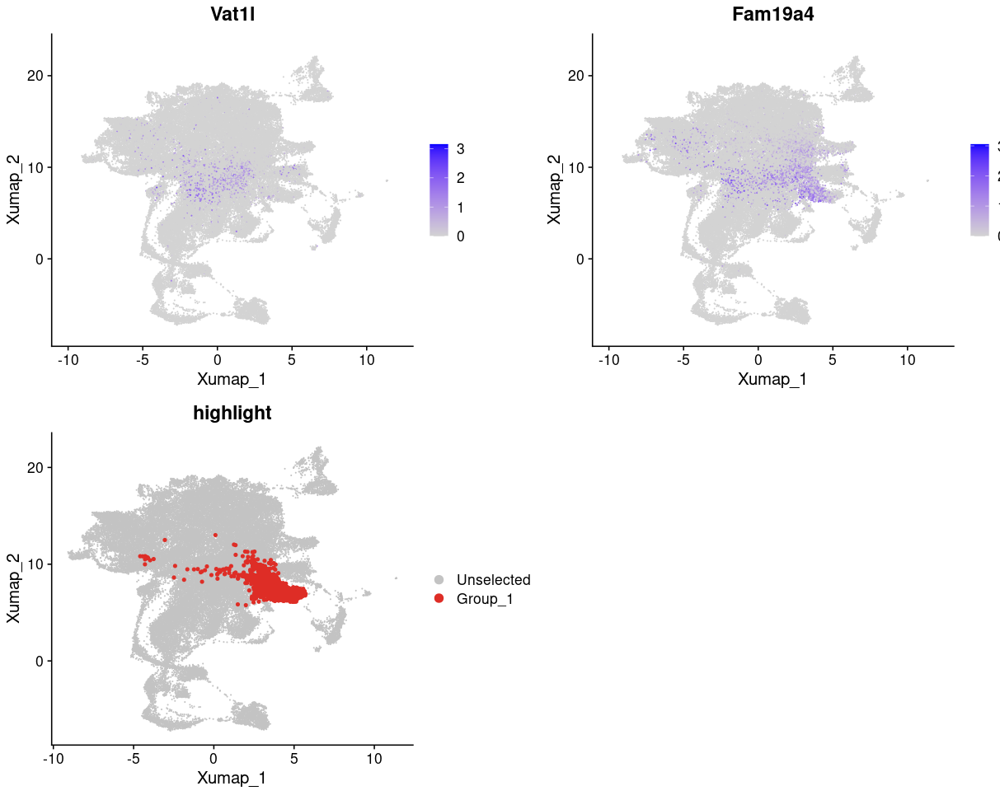

# Level 2 Annotation
## Dental Epithelial Progenitors
This cluster is annotated base on the time point, mainly E12.5-E15.5, with high development potential

## Enamel organ layers

These cells are differentiated, expressed the OEE markers (*Slco4a1*, *Th*), IEE markers (*Thbd*, *Jph4*) and SI markers (*Sfrp5*) {cite:p}`krivanekDentalCellType2020b`.

## Stellate reticulum
C12-3 expressed the SR markers (*Vatl1*, *Fam19a4*) {cite:p}`krivanekDentalCellType2020b`.

## Pre-ameloblast
Pre-ameloblast markers (*Col22a1*, *Vwde*, *Kif5c* {cite:p}`krivanekDentalCellType2020b`) are expressed in this cluster.

## Secretory ameloblast
We named this cluster base on the study described in {cite:p}`hermansEstablishmentInclusiveSinglecell2022`.

## Mature ameloblast
Mature ameloblast markers (*Odam*, *Klk4*, *Amtn* {cite:p}`hermansEstablishmentInclusiveSinglecell2022`) are expressed in this cluster.
