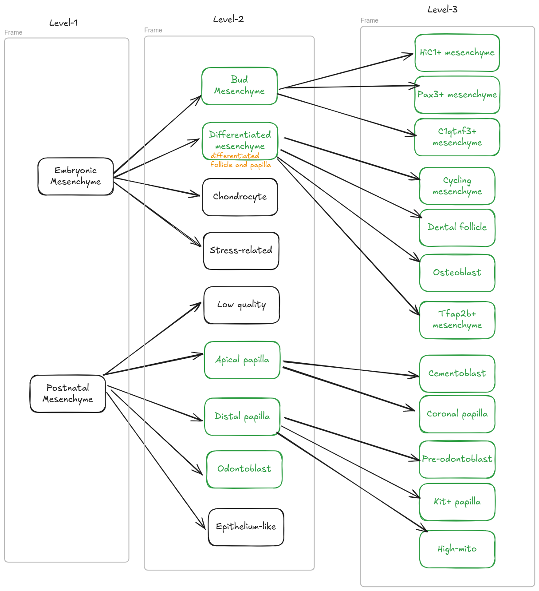
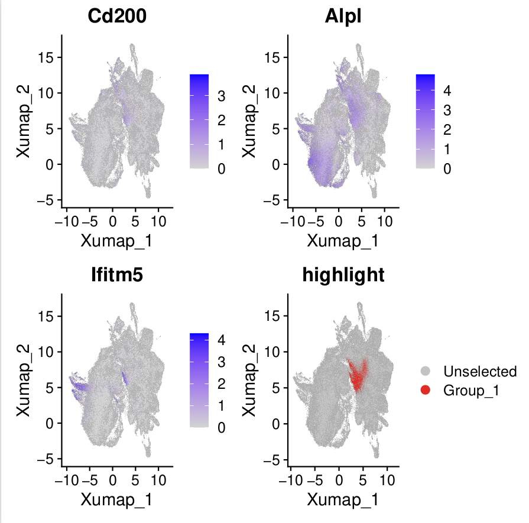
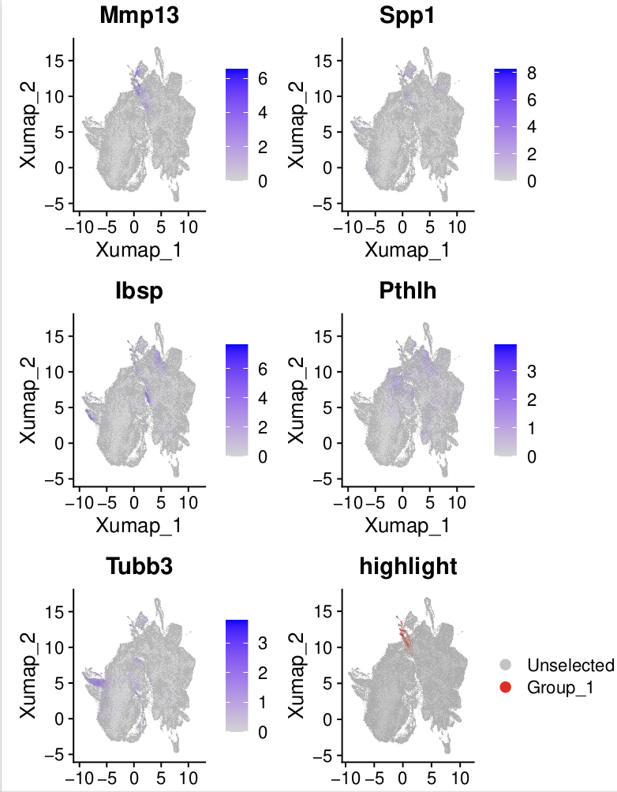
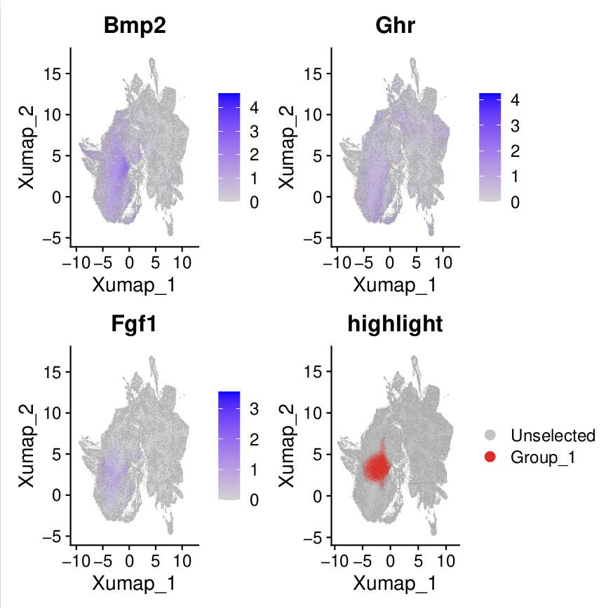
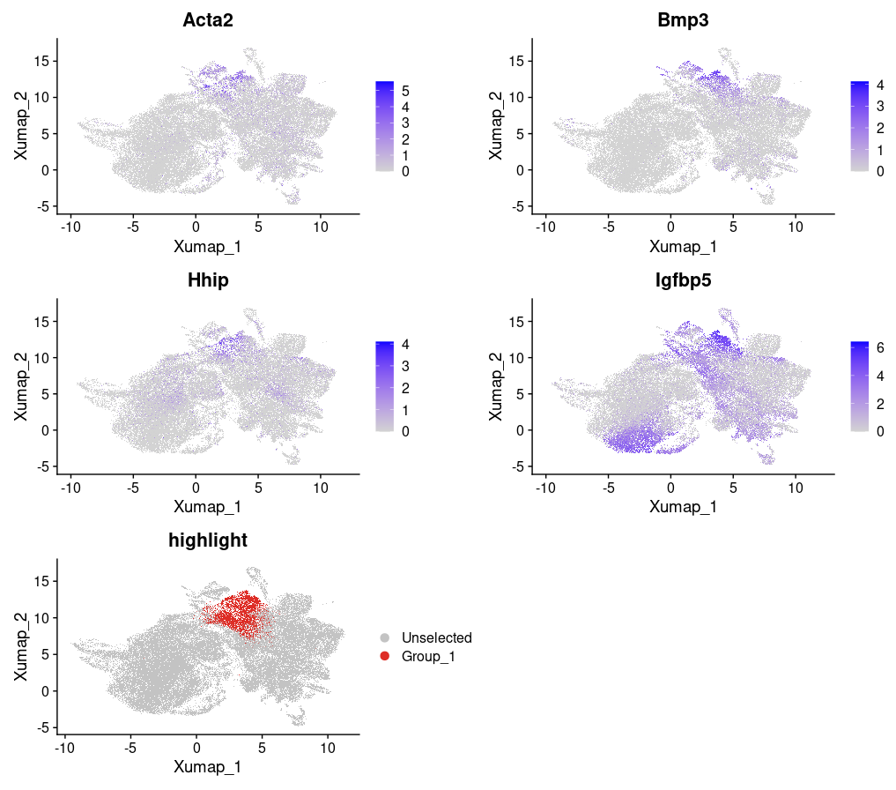
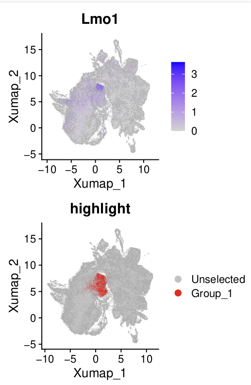
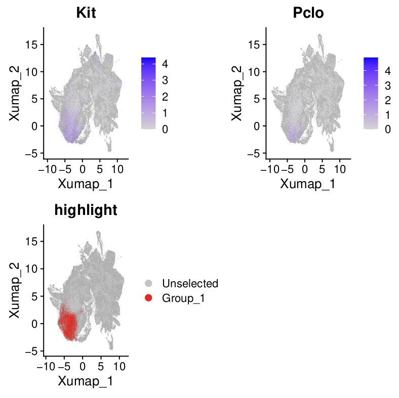
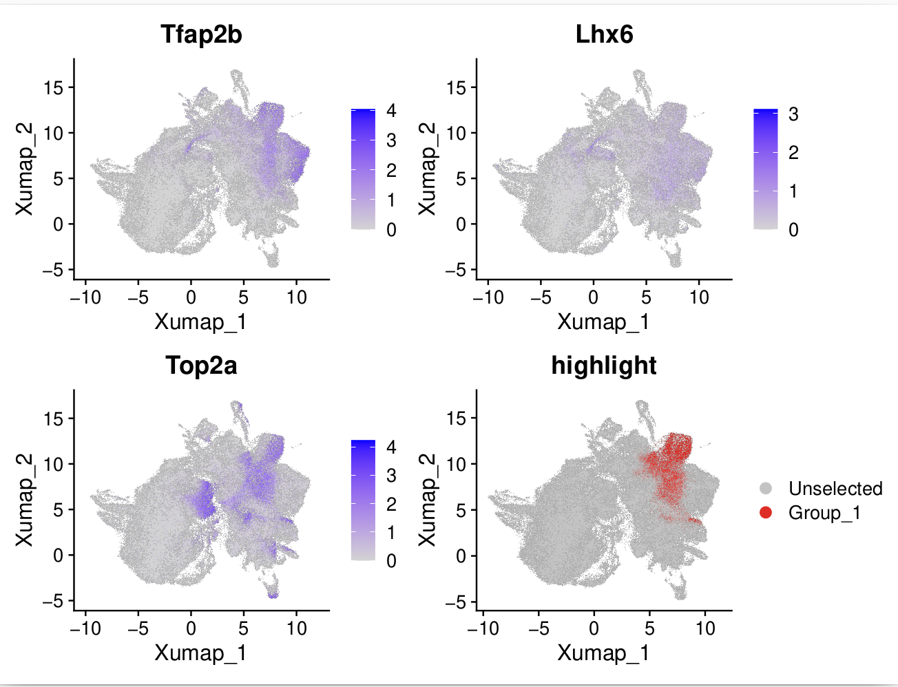
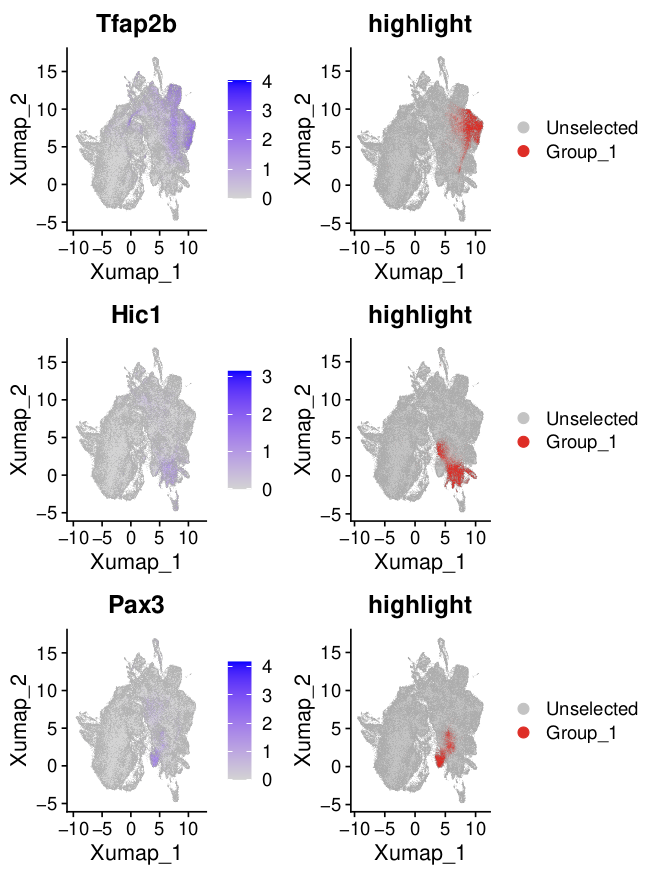
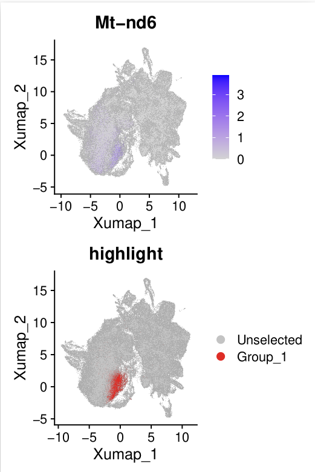

# Mesenchyme Level 3 Annotation

## Motivation

In level 3 annotation, we aim to identify subclusters of mesenchyme cells.

## Osteoblast
We discovered a cell cluster that highly expresses osteogenesis markers, such as *Cd200* {cite:p}`debnathDiscoveryPeriostealStem2018a`, *Alpl* {cite:p}`liuAlplPreventsBone2018`, and *Ifitm5* {cite:p}`ayturkSingleCellRNASequencinga`.

## Cementoblast
Our atlas also identified cementoblasts, which express *Pthlh* {cite:p}`nagataSingleCellTranscriptomicAnalysis2021`, *Tubb3* {cite:p}`nagataSingleCellTranscriptomicAnalysis2021`, *Ibsp* {cite:p}`hermansEstablishmentInclusiveSinglecell2022`, and *MMp13* {cite:p}`hermansEstablishmentInclusiveSinglecell2022`.

## Pre-odontoblast
We named this cluster based on the following reasons:
1. It was located near the odontoblast in the reduction.
2. It exhibited high expression of genes associated with differentiation-related signaling pathways.

## Dental follicle
This cluster expressed dental follicle markers, such as *Bmp3*, *Hhip* {cite:p}`jingSpatiotemporalSinglecellRegulatory2022`.

## Coronal Papilla
We annotated the coronal papilla based on the expression of *Lmo* {cite:p}`jingSpatiotemporalSinglecellRegulatory2022`.

## Kit+ Papilla
This cluster highly expresses _Kit_ and _Pclo_, aligning with results from this study {cite:p}`zhengSinglecellRNAseqAnalysis2024`.

## Cycling Mesenchyme
This subcluster of mesenchyme expresses cell cycle-related genes, such as _Top2a_. It also expresses early mesenchyme marker genes, such as _Tfap2b_ and _Lhx6_ {cite:p}`jingSpatiotemporalSinglecellRegulatory2022`.

## C1qtnf3+ Mesenchyme
We identified a cluster that specifically expresses _C1qtnf3_, aligning with the study {cite:p}`huDentalNicheCells2022`.

## Tfap2b+ Mesenchyme, Hic1+ Mesenchyme, Pax3+ Mesenchyme
These clusters were mainly annotated based on their marker genes.

## High-Mito
This cluster of cells highly expresses mitochondrial-related genes, which may be related to [technical bias](https://kb.10xgenomics.com/hc/en-us/articles/360001086611-Why-do-I-see-a-high-level-of-mitochondrial-gene-expression).

## Low Quality 2
    