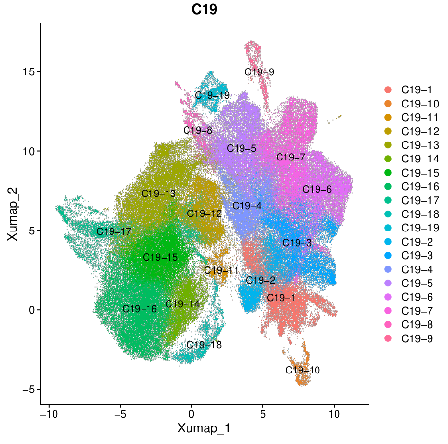
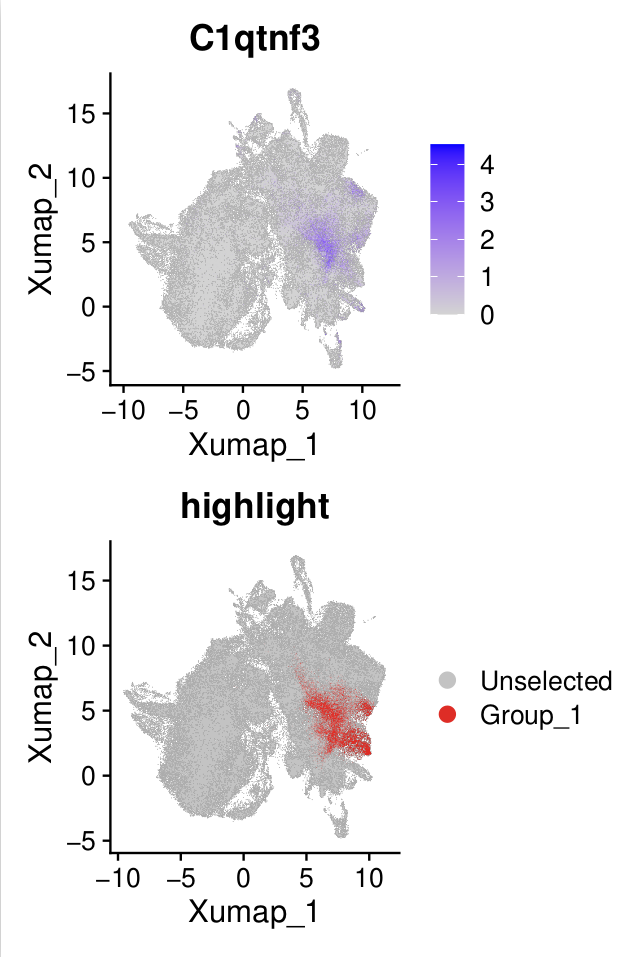
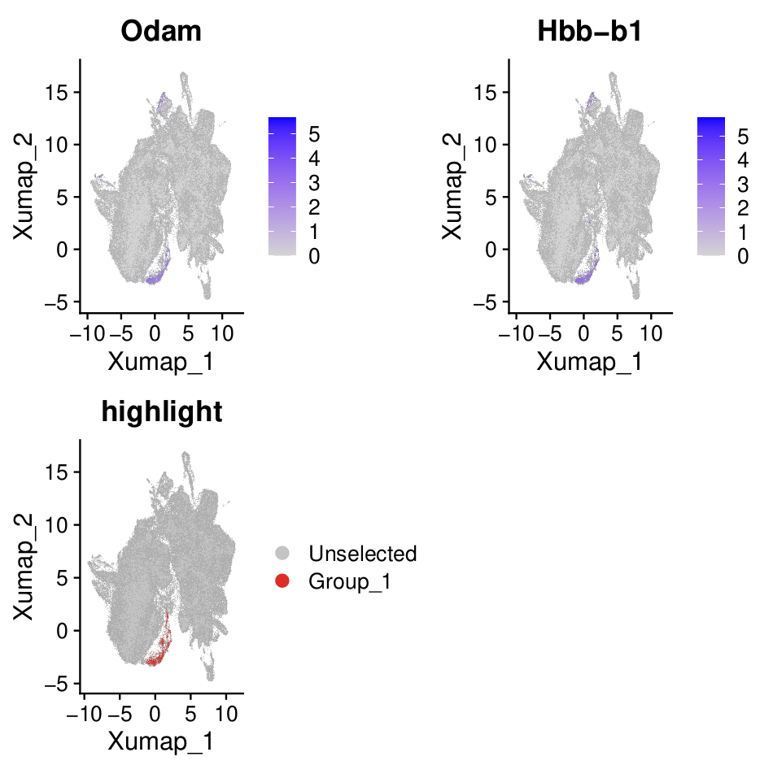

# Level 3 annotation

## Motivation
In level 3 annotaiton, we want to get subclusters of mesenchyme cells.

## Osteoblast
We found a cell cluster hihgly expressed osteogensis markers, like _Cd200_ {cite:p}`debnathDiscoveryPeriostealStem2018a`, _Alpl_ {cite:p}`liuAlplPreventsBone2018`, _Ifitm5_  {cite:p}`ayturkSingleCellRNASequencinga`. 

## Cementoblast

We also found that our atlas identified cementoblasts, which expressed _Pthlh_ {cite:p}`nagataSingleCellTranscriptomicAnalysis2021`, _Tubb3_ {cite:p}`nagataSingleCellTranscriptomicAnalysis2021`, _Ibsp_ {cite:p}`hermansEstablishmentInclusiveSinglecell2022`, _MMp13_ {cite:p}`hermansEstablishmentInclusiveSinglecell2022`.

## Pre-odontoblast
We named this cluster based on these reason:
1. It was near the odontoblast in the reduction.
2. It exhibited high expression of genes associated with differentiation-related signaling pathways.

## Coronal papilla
We based on _Lmo_ {cite:p}`jingSpatiotemporalSinglecellRegulatory2022` to annotate coronal papilla.

## Kit+ papilla
This cluster highly expressed _Kit_ and _Pclo_, align with results from this study {cite:p}`zhengSinglecellRNAseqAnalysis2024`.

## Cycling mesenchyme
This subcluster of mesenchyme express cell cycle related genes, like Top2a. It also expressed early mesenchyme marker genes, such as _Tfap2b_ and _Lhx6_. {cite:p}`jingSpatiotemporalSinglecellRegulatory2022`

## C1qtnf3+ mesenchyme
We found a cluster specificly express _C1qtnf3_, align with the study {cite:p}`huDentalNicheCells2022`.

## Tfap2b+ mesenchyme, Hic1+ mesenchyme, Pax3+ mesenchyme
These clusters I mainly base on the markers for annotation.

## High-Mito
This cluster cells highly express cells related to mitochondrial gene, which may relate with [technical bias](https://kb.10xgenomics.com/hc/en-us/articles/360001086611-Why-do-I-see-a-high-level-of-mitochondrial-gene-expression).

## Low quality 2

