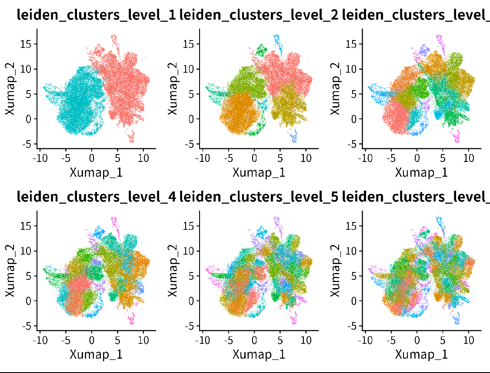

# Step 1: Choose the optimal cluster level
## Introduction
In this step, we will select the optimal cluster level from the previous [clustering results](20241025_mes_cluster.ipynb) to annotate the mesenchyme cells.

## Process
```R
#== function and package------------
rm(list=ls())
library(tidyverse)
source("script/utils//anno_integrate.R")
source("script/utils//stratified_wilcoxon_functions.R")

#== read parameters-------------------------

outdir <- "results/annotation/20241025_anno_step1/"


parameter_list = jsonlite::read_json("script/annotation/config/mesenchyme_parameter.json")
# if some fields are lists --> unlist
parameter_list = lapply(parameter_list,function(x){if(is.list(x)){return(unlist(x))}else{return(x)}})


assay_markers = parameter_list$assay_markers
assay_slot = parameter_list$assay_slot
test.use = parameter_list$test.use
logfc.threshold = parameter_list$logfc.threshold
min.pct =parameter_list$min.pct
min.diff.pct = parameter_list$min.diff.pct
max.cells.per.ident = parameter_list$max.cells.per.ident
min.cells.feature = parameter_list$min.cells.feature
min.cells.group =  parameter_list$min.cells.group
base = parameter_list$base
only.pos = parameter_list$only.pos
use_stratified=parameter_list$use_stratified
batch_var = parameter_list$batch_var
test.use = parameter_list$test.use
message("test.use ",test.use," ... ",parameter_list$test.use)
if(is.null(base)){base = 2}


#== load clusters & seurat object--------------------
mesenchyme <- zellkonverter::readH5AD("processed_data/integrated_data/20241024_mesenchyme.h5ad")
varname <- read.csv("processed_data/attributeName/varName.csv",row.names = 1) %>% unlist()
cellname <- read.csv("processed_data/attributeName/cellName_mes.csv",row.names = 1) %>% unlist()
rownames(mesenchyme) <- varname
colnames(mesenchyme) <- cellname
seurat <- as.Seurat(mesenchyme,counts = "counts", data = "logcounts")

wtIntegrate_clusterint  = data.table::fread("processed_data/metadata/20241025_mes_leiden_metadata.csv",data.table = F)
wtIntegrate_clusterint  = wtIntegrate_clusterint [,c(1,3:ncol(wtIntegrate_clusterint ))]


# load seurat
#curated_seurat_object = readRDS(paste0(parameter_list$harmonization_folder_path,parameter_list$new_name_suffix,"_curated",".rds"))

seurat = FindNeighbors(seurat,
                       reduction="X_SCANVI",
                            dims = 1:ncol(seurat@reductions[["X_SCANVI"]]@cell.embeddings),
                            nn.method="annoy", graph.name = "SNN_scANVI",verbose=TRUE)

# get nn
neighbor_nn = as.Neighbor(seurat@graphs$SNN_scANVI)
nn_idx = neighbor_nn@nn.idx

#== load cluseter----------------------
seurat@meta.data$Cell_ID <- colnames(seurat)
wtIntegrate_clusterint$Cell_ID <- colnames(seurat)
temp_meta = dplyr::left_join(seurat@meta.data,wtIntegrate_clusterint,by="Cell_ID")
rownames(temp_meta) = temp_meta$Cell_ID
seurat@meta.data = temp_meta
cluster_column = colnames(wtIntegrate_clusterint)[ncol(wtIntegrate_clusterint)]

wtIntegrate_clusterint_clear = apply(wtIntegrate_clusterint[,2:ncol(wtIntegrate_clusterint)],2,clear_clustering,min_cells = parameter_list$min_cells_valid,nn_idx = nn_idx) %>% as.data.frame()
#wtIntegrate_clusterint_clear <- subset(wtIntegrate_clusterint_clear,select=-Cell_ID)
#length(table(wtIntegrate_clusterint_clear$leiden_clusters_0.1))
sort(apply(wtIntegrate_clusterint_clear,2,function(x){length(table(x))}))


# add cell id
wtIntegrate_clusterint_clear = dplyr::bind_cols(Cell_ID = wtIntegrate_clusterint$Cell_ID,wtIntegrate_clusterint_clear)


# make summary of clusters per level
wtIntegrate_clusterint_long = wtIntegrate_clusterint_clear %>% dplyr::select(-Cell_ID) %>% tidyr::gather(key="cluster_level",value="cluster_id")
wtIntegrate_clusterint_long_summary = wtIntegrate_clusterint_long %>% dplyr::group_by(cluster_level) %>%
  dplyr::summarise(n=length(unique(cluster_id))) %>% dplyr::arrange(n)
wtIntegrate_clusterint_long_summary$cluster_level = factor(wtIntegrate_clusterint_long_summary$cluster_level,levels = wtIntegrate_clusterint_long_summary$cluster_level)

#seurat$merge_id_level3

#== MODIFY cluster------------------
# Each level of cluster number should roughly 1.5-2 times larger than the previous level.
p1 <- DimPlot(seurat,group.by = "leiden_clusters_0.05")
#DimPlot(seurat,group.by = "leiden_clusters_0.1")
p2 <- DimPlot(seurat,group.by = "leiden_clusters_0.175")
p3 <- DimPlot(seurat,group.by = "leiden_clusters_0.5")
p4 <- DimPlot(seurat,group.by = "leiden_clusters_1")
p5 <- DimPlot(seurat,group.by = "leiden_clusters_3")
p5 <- DimPlot(seurat,group.by = "leiden_clusters_5")
p1 <-  DimPlot(seurat,group.by = "mix_level_2")
p2 <- DimPlot(seurat,group.by = "leiden_clusters_0.05")
p1+p2+p3+p4+p5

seurat$leiden_clusters_level_1 <- seurat$leiden_clusters_0.05
seurat$leiden_clusters_level_2 <- seurat$leiden_clusters_0.175
seurat$leiden_clusters_level_3 <- seurat$leiden_clusters_0.5
seurat$leiden_clusters_level_4 <- seurat$leiden_clusters_1
seurat$leiden_clusters_level_5 <- seurat$leiden_clusters_3
seurat$leiden_clusters_level_6 <- seurat$leiden_clusters_5


cluster_cols=c("leiden_clusters_level_1","leiden_clusters_level_2","leiden_clusters_level_3","leiden_clusters_level_4",
               "leiden_clusters_level_5","leiden_clusters_level_6")
mrtree_input_labels = seurat@meta.data[,cluster_cols]

# modify level1 annotation
seurat$leiden_clusters_level_1[seurat$leiden_clusters_level_1%in%c(2,3)] <- 0
seurat$leiden_clusters_level_1 <- factor(seurat$leiden_clusters_level_1,levels = c(0,1))

DimPlot(seurat,group.by = cluster_cols)&theme(legend.position = "none")
ggsave(paste0(outdir,"20241025_annotation_level.png"),width = 8,height = 6)

apply(mrtree_input_labels,2,function(x){length(table(x))})
# mrtree_input_labels$leiden_clusters_level_1
# x_factor <- factor(mrtree_input_labels$leiden_clusters_level_1, levels = unique(mrtree_input_labels$leiden_clusters_level_1))
# x_numeric <- as.numeric(x_factor)
# mrtree_input_labels$leiden_clusters_level_1 <- x_numeric
# x_factor <- factor(mrtree_input_labels$leiden_clusters_level_2, levels = unique(mrtree_input_labels$leiden_clusters_level_2))
# x_numeric <- as.numeric(x_factor)
# mrtree_input_labels$leiden_clusters_level_2 <- x_numeric

#== save data----------------------------
seurat@meta.data = seurat@meta.data[,!grepl("leiden_clusters_",colnames(seurat@meta.data))]
#add
seurat@meta.data = cbind(seurat@meta.data,mrtree_input_labels)

data.table::fwrite(mrtree_input_labels,"processed_data/metadata//20241025_mes_anno_mrtree_input_label.csv")

saveRDS(seurat,"processed_data/integrated_data/20241024_mesenchyme.Rds")

```

