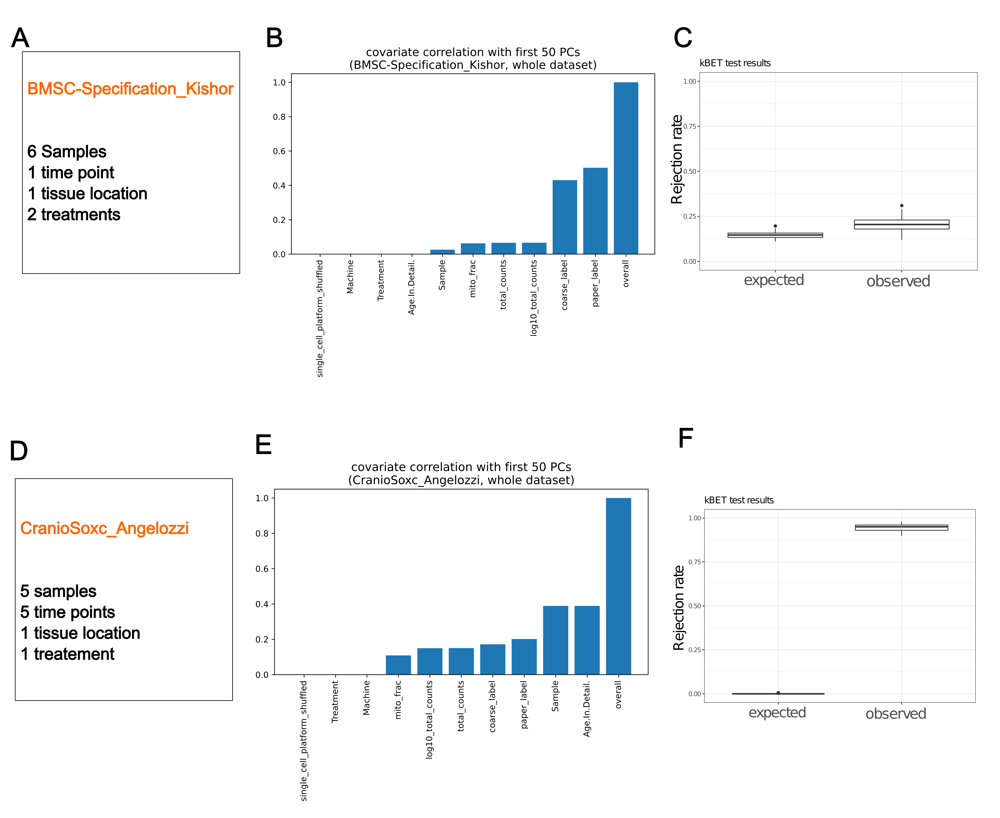

# Batch division

## Introduction

Batch correction algorithms have the potential to remove not only technical variation but also biological variation {cite:p}`liTradeconservationBiologicalVariation2022`. In our reference atlas, it is crucial to distinguish cell states with fine resolution, making it essential to differentiate between technical and biological variation. Our atlas includes multi-level batch covariates, such as datasets, samples, age, and tissue location. Deciding which levels of variation to retain and which to correct can significantly impact the results. Although batch division is not a common step in regular single-cell RNA sequencing (scRNA-seq) data analysis, constructing comprehensive atlases often involves this step {cite:p}`steuernagelHypoMapUnifiedSinglecell2022` {cite:p}`sikkemaIntegratedCellAtlas2023`.

## Methods

### Quantifying the Source of Variance

Inspired by two excellent papers {cite:p}`sikkemaIntegratedCellAtlas2023` {cite:p}`buttnerTestMetricAssessing2019`, we adopted two methods to determine the appropriate batch covariates. First, we conducted principal component regression to calculate the fraction of variance explained by the covariate of interest within the first 50 principal components. Our analysis revealed that, in some samples, the variance in cell type was considerably greater than the variance across samples. Consequently, it is more appropriate to treat the entire dataset as a single batch rather than treating each of the six samples as separate batches. Conversely, in the CranioSoxc_Angelozzi dataset, sample variance was even greater than cell type variance. Therefore, it is more appropriate to treat each of the six samples as individual batches in this case.

### Quantifying Batch Effects through kBET

We utilized kBET, which is based on k-nearest neighbors, to assess whether all batches are well-mixed. In the BMSC-Specification_Kishor dataset, we observed that the rejection rates were similar between the observed and expected values. In contrast, for the CranioSoxc_Angelozzi dataset, the rejection rates were significantly higher than expected.

## Conclusion

By applying these methods, we meticulously evaluated each dataset to effectively minimize technical variation while preserving biological variation. This careful consideration ensures that our reference atlas maintains high resolution in distinguishing cell states, which is essential for accurate biological interpretation.

