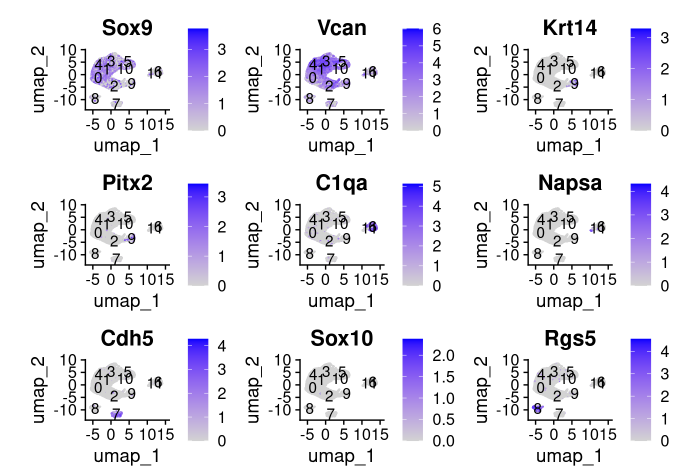
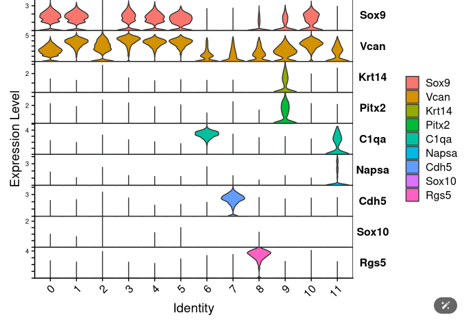
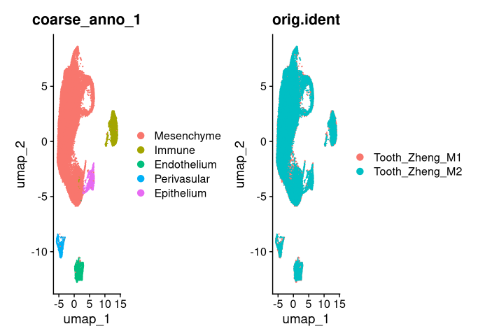

# First round annotation
## Introduction
In the first round annotation, we recommend to coarsely annotate the cell types. It serves two purposes:
1. Some integration algorithms are ultilized cell type information, for example, scANVI {cite:p}`xuProbabilisticHarmonizationAnnotation2021` and scPoli {cite:p}`dedonnoPopulationlevelIntegrationSinglecell2023`.
2. It can help us to diagnose the integration results.

## Curated marker genes
Though the cell type may have great variance across tissues and ages, the main cell types are consistent across datasets. In the first round annotation, the annotation should be unified. Base on the literature, we summarized the cell types that commonly exist in the literature, and make a marker gene lists.

<iframe src="https://docs.google.com/spreadsheets/d/1LQ5yZiX8caeKhuV8e1-muWGyxcWoa_HHOgk4wfBFJSk/edit?usp=sharing" width="60%" height="400"></iframe>

## Procedure

```R
knitr::opts_chunk$set(echo = TRUE)
knitr::opts_knit$set(root.dir = "/home/gilberthan/Desktop/disk2/202409_tooth/") # set working directory

```

Load Environment


```R
library(Seurat)
library(dplyr)
library(ggplot2)
outputdir <- "process/annotation/first_round_base/"
baseName <- "Tooth_Zheng" # You should change this.
seurat <- readRDS(paste0("preprocess_data/",baseName,".Rds"))
source("script/utils/seurat_utils.R")
```

Visualization


```R
markers <- c("Sox9","Vcan",  # Mesenchyme
             "Krt14","Pitx2",# Epithelium
             "C1qa","Napsa", #Immune
             "Cdh5", #Endo
             "Sox10", # neuron
             "Rgs5" # perivasular
             ) 
FeaturePlot(seurat,markers,label = T)
ggsave(paste0(outputdir,"plot/",baseName,"_EDA_FeatUmap.pdf"))
```

```R
VlnPlot(seurat,markers,stack = T,flip = T)
ggsave(paste0(outputdir,"plot/",baseName,"_EDA_Vln.pdf"))
```

```R
dput(levels(seurat))

```
```R
newID <- c("Mesenchyme", "Mesenchyme", "Mesenchyme", "Mesenchyme", "Mesenchyme", "Mesenchyme", "Immune", "Endothelium", "Perivasular", 
           "Epithelium", "Mesenchyme", "Immune"
)
seurat <- renameLabel(seurat,newID,"coarse_anno_1") # first parameter : seurat; Second parameter : new ID, which order same with level; third para : the slot you want to store in metadata
```

Validation
```R
p1 <- DimPlot(seurat,group.by = "coarse_anno_1")
p2 <- DimPlot(seurat,group.by = "orig.ident")
p1|p2
ggsave(paste0(outputdir,"plot/",baseName,"_validation_umap.pdf"))
```


Store data

Do NOT overwrite the seurat RDS!!!

Just save the annotation information.

```R
label <- seurat$coarse_anno_1 %>% as.data.frame()
colnames(label) <- "Coarse_Label_1"

write.csv(label,paste0(outputdir,"anno/",baseName,".csv"))
```

When read the label, it should be like this
```R
loadLabel <- read.csv(paste0(outputdir,"anno/",baseName,".csv"),row.names = 1)
loadLabel %>% head()
```
