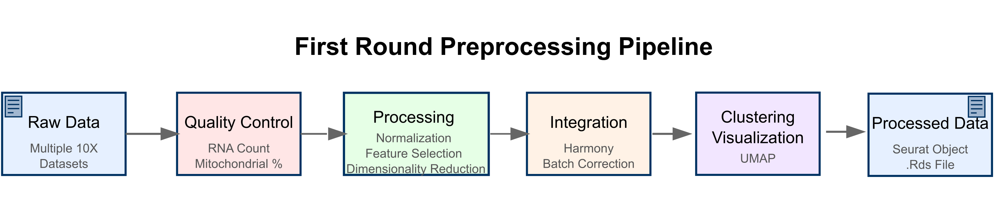

# First round preprocess

## Aim of first round preprocess
The goal of first round preprocess is to generate a clean and standard data for downstream analysis. So we build an standard pipeline to perform basic quality control and annotation.




## Utils that used in this step
The utils can be found in [github](https://github.com/GilbertHan1011/toothAtlasManuscript/blob/main/script/utils/seurat_utils.R).

```R
#== seurat quality control----------------
qcFun <-  function(x,nCount_RNA=800,percent_mito=20,nFeature_RNA=300,Species="Mouse"){
  if(Species == "Mouse"){
    x <- PercentageFeatureSet(x, "^mt-", col.name = "percent_mito")
  } else if(Species == "Human"){
    x <- PercentageFeatureSet(x, "^MT-", col.name = "percent_mito")
  }
  x <- x[,(x$nCount_RNA > nCount_RNA & x$percent_mito < 20 & x$nFeature_RNA > 300)]
  #x <- subset(x, cells = selected_count)
  return(x)
}
#== harmony function---------------------------------------
runharmony <- function(x,dim=30){
  require(harmony)
  x <- NormalizeData(x, normalization.method = "LogNormalize", scale.factor = 10000)
  x <- FindVariableFeatures(x, selection.method = "vst", nfeatures = 2000)
  all.genes <- rownames(x)
  x <- ScaleData(x, features = all.genes)
  x <- RunPCA(x, features = VariableFeatures(object = x))
  x <- RunHarmony(x, "orig.ident",reduction.use = "pca")
  x <- FindNeighbors(x, dims = 1:dim,reduction = "harmony")
  x <- FindClusters(x, resolution = 0.5)
  x <- RunUMAP(x, dims = 1:dim,reduction = "harmony")

}

# Wrapped function for easy processing scRNA datasets
process_seurat_data <- function(data_directory, min_cells = 3, min_features = 500, qc_mito = 20,qc_rna = 300,species = "Mouse") {
  require(Seurat)
  require(dplyr)
  require(purrr)
  # List all files in the specified directory
  fileNames <- list.files(data_directory, full.names = TRUE)
  fileShort <- list.files(data_directory, full.names = FALSE)

  # Read the 10X data
  countList <- lapply(fileNames, Read10X)
  print("creating seurat object")
  # Create Seurat objects with quality control
  seuratList <- map2(countList, fileShort, function(x, y) {
    CreateSeuratObject(x, min.cells = min_cells, min.features = min_features, project = y)
  })

  # Apply quality control function
  seuratList <- lapply(seuratList, qcFun,percent_mito=qc_mito,nFeature_RNA=qc_rna,Species=species)

  # Merge all Seurat objects
  seuratMerge <- merge(seuratList[[1]], seuratList[2:length(seuratList)])
  print("Running harmony")
  # Run Harmony
  seuratMerge <- runharmony(seuratMerge)

  return(seuratMerge)
}
```

## basic process script

```R
rm(list=ls())
source("script/utils/seurat_utils.R")
dirName  = "../202409_tooth_raw/Incisor_Zhang/"
seuratMerge <- process_seurat_data(dirName)
saveRDS(seuratMerge,"preprocess_data/Incisor_Zhang.Rds")
```

