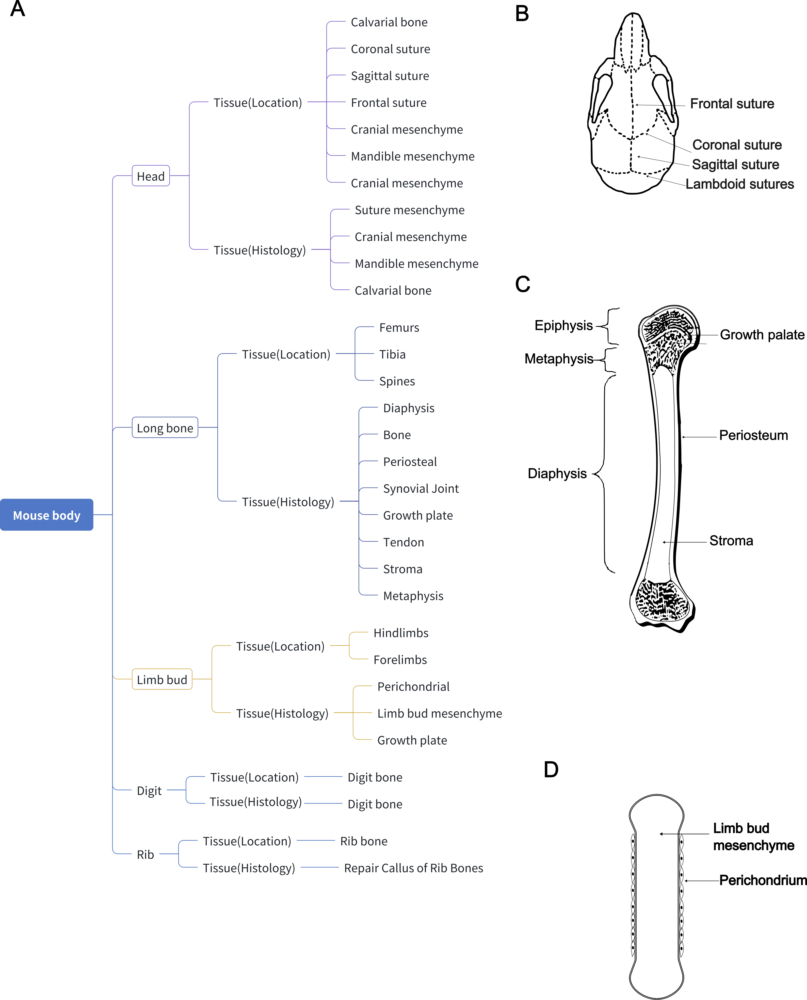
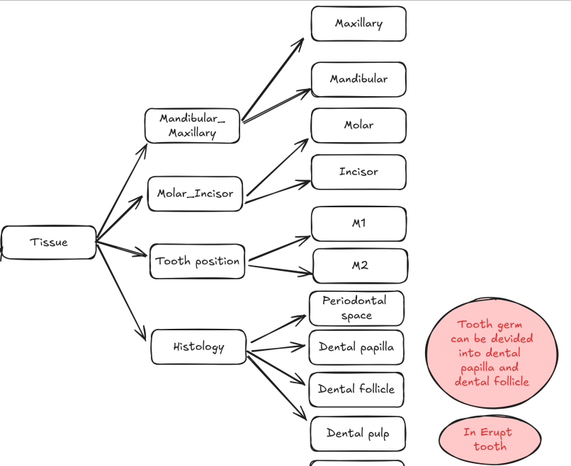
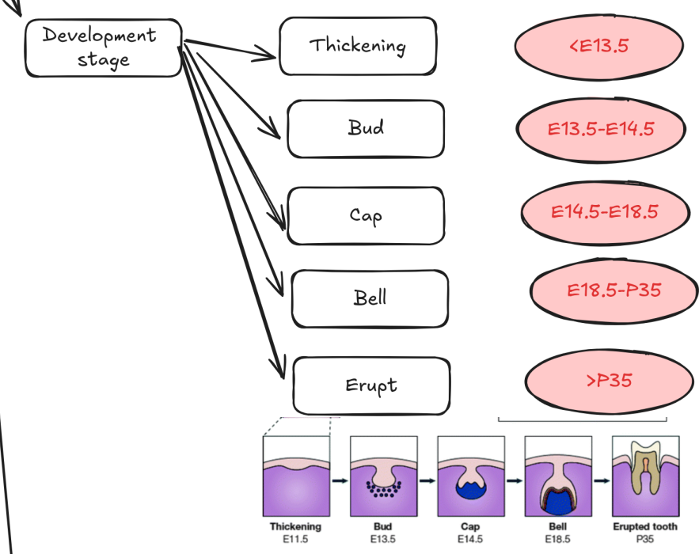
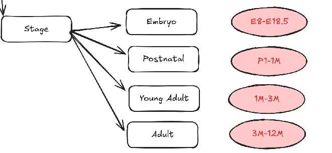

# Metadata Collection
## Introduction
When you're working on large-scale single-cell datasets, you should manually collect metadata for each study. Here are some benefits:

- It allows you to build a standard criterion to compare across studies.
- It allows you to conveniently add study-level annotations to cell-level metadata.
- It allows you to access the information you need quickly.

## What metadata to collect?
While this is highly dependent on the study, here are some general categories of metadata that are often collected:

- Study metadata:
    - Study name
    - Sample name
    - Data accession
    - Study publication journal
    - Study publication year
- Biological covariates:
    - Tissue information
    - Age
    - Gene type
    - Treatment
    - Disease
    - Organism
- Technical covariates:
    - Sequencing platform
    - Dissociation enzyme

In the following sections, we will go through an example of the metadata we collected in the tooth atlas.

## Study metadata
### Study name & Sample name
Usually, we define the study as one publication conducted by one lab. Samples in the same study are usually comparable. For example, the paper [**Spatiotemporal single-cell regulatory atlas reveals neural crest lineage diversification and cellular function during tooth morphogenesis**](https://www.nature.com/articles/s41467-022-32490-y) {cite:p}`jingSpatiotemporalSinglecellRegulatory2022` conducted by Yang Chai lab contains five samples ranging from E13.5 to PN7.5 in mouse embryo development. In my convention, I use characters "uniqueID+author" to name the study and use "uniqueID+sampleName" to name the sample. In this example, the study name is `ToothNc_Junjun` and the sample name is `ToothNc_Junjun_E13.5`. The most important thing is the study name should be easy to remember and unique.

### Data accession
This is the accession number of the data. For example, the data of `ToothNc_Junjun` is [GSE189381](https://www.ncbi.nlm.nih.gov/geo/query/acc.cgi?acc=GSE189381). Once you have recorded this information, you can easily access the data if you forget the data source.

## Biological covariates
### Tissue information
This is the most tricky part, and it is highly dependent on your purpose. For example, when I build the [Differentiation Atlas](https://trajatlas.readthedocs.io/en/stable/introduction/Differentiation_Atlas.html) focused on bone development, I found it's hard to use one single tissue information to summarize the tissue information. So I use multi-level tissue information for description. Some reviews {cite:p}`mizoguchiDiverseOriginBoneforming2021` suggest there are three main organs that generate the osteoblasts: Head, Limb bud, and Long bone, and the osteogenic pathways are significantly different across the organs. So I used **tissue origin** which contains these three categories to describe the main organ sources. And in a finer resolution, we can see that the organ can be divided into the **histological** and **tissue location** subtypes {cite:p}`shuTracingSkeletalProgenitor2021`. For example, the long bone can be divided into metaphysis, diaphysis, and epiphysis, which are histologically different. And it can also be divided into tibia, femur, which is location different. Therefore, I finally form three-level tissue metadata.


And in tooth development, the situation is completely different. First, the tooth from **mandibular or maxillary** may have great shape and transcriptional differences {cite:p}`faruangsaengComparativeTranscriptomeProfiles2022` {cite:p}`pantalacciTranscriptomicSignaturesShaped2017`. This is significant in mice, as the mandibular incisors of mice are longer than maxillary incisors. 

Even more significant is the distinction between **tooth types**. The differences between molars and incisors extend beyond shape to include enamel structure. In incisors, the enamel exhibits a uniserial lamellar pattern of prisms in the inner enamel, while the outer enamel features parallel radial prisms. In contrast, molars display a multifaceted rod pattern with more variable structures than those found in incisors.{cite:p}`seidelResolvingStemProgenitor2017` 
```{figure} ../img/20241023_enamel.png
:alt: fishy
:class: bg-primary
:width: 800px
:align: center

Comparison of incisor and molar enamel structure. Figure adapted from {cite:p}`seidelResolvingStemProgenitor2017`.
```

Some studies may focus on a specific **tooth histology type**. For example the study {cite:p}`krivanekDentalCellType2020b` use the dental pulp as the tissue source, while the study {cite:p}`luoSix1RegulatesMouse2024` focus on the tooth germ.

### Age
Another important biological covariate is **age**. Based on the shape of tooth germ, we can roughly divide the tooth development into five stages: thicking, bud, cap, bell and erupted. {cite:p}`tuckerCuttingedgeMammalianDevelopment2004`

Studies also report the age-related difference in the dental pulp. {cite:p}`wuDerivationGrowthCharacteristics2015` Therefore, we also collect the detailed age information for each sample and base on the age we divided into different stages.


## Technical covariates

### Sequencing platform
Different platform may have huge impact on batch effect because of the different sequencing depth, handling personnel, reagent lots and equipments {cite:p}`tranBenchmarkBatcheffectCorrection2020`. Even the same platform with different protocols, like 10Xv2 and 10Xv3, may also matters {cite:p}`sikkemaIntegratedCellAtlas2023`. Therefore, we collect these information for each sample.
