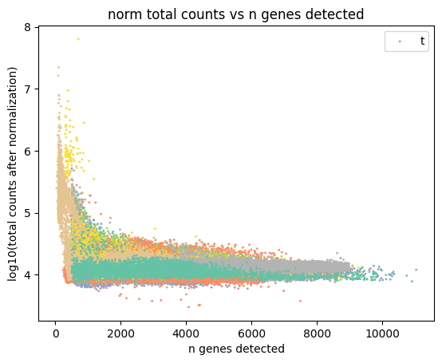
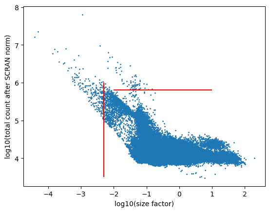

# Normalization and post normalization

This document describes the normalization process and downstream analysis workflow for the tooth atlas single-cell RNA-seq data. The workflow consists of two main steps: (1) Normalization and (2) Post-normalization processing.

## 1. Data Normalization

Normalization is a critical step in single-cell RNA-seq analysis that helps correct for technical variation across cells and enables accurate comparison between different samples. Our normalization procedure implements the methods used in {cite:p}`sikkemaIntegratedCellAtlas2023`.

### Setup and Dependencies

```python
import numpy as np
import pandas as pd
import scanpy as sc
import sys
from scipy import sparse
import seaborn as sns
import matplotlib.pyplot as plt
# Import custom utility functions
sys.path.append("../utils/")
import pre_processing
import sci_excerpts

# For integration with R/scran
import anndata2ri
import rpy2.robjects as ro
import rpy2.rinterface_lib.callbacks
```

### Loading Pre-processed Data

We start with data that has already undergone initial quality control and gene filtering:

```python
# Load data that has been filtered in step 1
adata = sc.read_h5ad("../../process/pre-intergration/big_data/20241019_mergeall_filter_gene_step1.h5ad")
```

### Normalization Strategy

We implement a sophisticated normalization approach using the [scran package](https://bioconductor.org/packages/3.21/bioc/html/scran.html) from R, which performs pool-based size factor estimation. This method is particularly effective for single-cell data because it accounts for biological heterogeneity better than global scaling methods.

Our normalization consists of several key steps:

1. **Preliminary clustering for differentiated normalization**
2. **Size factor estimation using scran's computeSumFactors**
3. **Normalization using the computed size factors**

```python
# Set parameters
n_pcs = 50
counts_per_cell = 1e4
louvain_r = 0.5
log_transform = False

# Activate R interface
anndata2ri.activate()
ro.r('library("scran")')
    
# Keep raw counts for reference
adata.layers["counts"] = adata.X.copy()
    
# Preliminary clustering for differentiated normalization
adata_pp = adata.copy()
sc.pp.normalize_per_cell(adata_pp, counts_per_cell_after=counts_per_cell)
sc.pp.log1p(adata_pp)
sc.pp.pca(adata_pp, n_comps=n_pcs, svd_solver='arpack')
sc.pp.neighbors(adata_pp)
sc.tl.louvain(adata_pp, key_added='groups', resolution=louvain_r)  

# Use scran for size factor estimation
ro.globalenv['data_mat'] = adata.X.T
ro.globalenv['input_groups'] = adata_pp.obs['groups']
size_factors = ro.r('sizeFactors(computeSumFactors(SingleCellExperiment('
                    'list(counts=data_mat)), clusters = input_groups,'
                    f' min.mean = {0.1}))')

# Apply size factors to normalize data
adata.obs['size_factors'] = size_factors
adata.X = adata.layers["counts"].copy()
adata.X = adata.X.multiply(1/adata.obs['size_factors'].values[:, None]).tocsr()

# Log transform if specified
if log_transform:
    sc.pp.log1p(adata)
```


## 2. Post-Normalization Filtering

### Load Normalized Data
```python
# Load the normalized data
adata = sc.read("../../process/pre-intergration/big_data/20241019_mergeall_normalized_step2.h5ad")
```

### Dataset Exploration
```python
# Check available projects in the dataset
projectName = adata.obs["Project"].unique()
projectLen = len(adata.obs["Project"].unique())
```

### Quality Control Visualization

Several visualizations are created to assess data quality and determine appropriate filtering thresholds:

```python
# Create a color map for visualization by project
gb_values = sns.color_palette("Set2", projectLen)
color_labels = adata.obs["Project"].unique()
color_map = dict(zip(color_labels, gb_values))

# Size factor vs total counts scatter plot
plt.scatter(
    adata.obs.total_counts,
    adata.obs.size_factors,
    c=[color_map.get(p, 'gray') for p in adata.obs["Project"].values],
    s=1
)
plt.xlabel("Total Counts")
plt.ylabel("Size Factor")
plt.xlim(0, 1000000)
plt.ylim(0, 110)
plt.savefig("qc_sizefactor_count.pdf")
```

```python
# Calculate normalized total counts
new_totals = np.array(np.sum(adata.X, axis=1))

# Distribution of normalized counts
plt.hist(np.log10(new_totals), bins=50)
plt.xlabel("log10(total counts after normalization)")
plt.ylabel("n cells")
plt.vlines(x=5.6, ymin=0, ymax=40000, color="red")
plt.title("post-normalization total counts distribution")
```

```python
# Gene detection vs normalized counts
sc.pp.calculate_qc_metrics(adata, inplace=True, layer="counts")
plt.scatter(
    adata.obs.n_genes_by_counts.values,
    np.log10(new_totals),
    s=1,
    c=[color_map.get(p, 'gray') for p in adata.obs["Project"].values],
)
plt.xlabel("n genes detected")
plt.ylabel("log10(total counts after normalization)")
plt.title("norm total counts vs n genes detected")
```

```python
# Size factor distribution
plt.hist(np.log10(adata.obs.size_factors), bins=50)
plt.xlabel("log10(size factor)")
plt.ylabel("ncells")
plt.vlines(x=np.log10(0.005), ymin=0, ymax=30000, color="red")
plt.title("SCRAN size factor distribution")
```

```python
# Size factor vs normalized counts
plt.scatter(np.log10(adata.obs.size_factors.values), np.log10(new_totals), s=1)
plt.vlines(x=np.log10(0.005), ymin=3.5, ymax=6, color="red")
plt.hlines(y=5.8, xmin=-2, xmax=1, color="red")
plt.xlabel("log10(size factor)")
plt.ylabel("log10(total count after normalization)")
```

### Cell Filtering Based on Quality Control Metrics

Based on the quality control visualizations, cells are filtered using two main criteria:

1. Size factor threshold: Cells with size factors < 0.005 are removed as they represent potential low-quality cells
2. Normalized total count threshold: Cells with normalized total counts > 10^5.8 are removed as potential doublets or outliers

```python
# Apply filtering criteria
cells_to_filter_out = adata[
    [
        norm_total_count_filter or sf_filter
        for norm_total_count_filter, sf_filter in zip(
            (new_totals > 10**5.8).flatten().tolist(), 
            adata.obs.size_factors < 0.005
        )
    ],
    :,
].copy()

# Save filtered-out cells for reference
cells_to_filter_out.write_h5ad(path_cells_removed_data)

# Keep only cells that pass QC filters
filter_boolean = ~adata.obs.index.isin(cells_to_filter_out.obs.index)
adata = adata[filter_boolean, :].copy()

# Additional filtering to retain only core datasets
adata = adata[adata.obs["Core_datasets"]=="True"]
```

### Highly Variable Gene Selection

After cell filtering, highly variable genes are identified for downstream analysis:

```python
# Function to calculate variances on sparse matrix
def vars(a, axis=None):
    """ Variance of sparse matrix a
    var = mean(a**2) - mean(a)**2
    """
    a_squared = a.copy()
    a_squared.data **= 2
    return a_squared.mean(axis) - np.square(a.mean(axis))
    
# Calculate means and dispersions
means = np.mean(adata.X, axis=0)
variances = vars(adata.X, axis=0)
dispersions = variances / means
min_mean = 0.03

# Plot mean vs dispersion
plt.scatter(
    np.log1p(means).tolist()[0], 
    np.log(dispersions).tolist()[0], 
    s=2
)
plt.vlines(x=np.log1p(min_mean), ymin=-3, ymax=6, color='red')
plt.xlabel("log1p(mean)")
plt.ylabel("log(dispersion)")
plt.title("DISPERSION VERSUS MEAN")

# Identify highly variable genes
sc.pp.highly_variable_genes(
    adata, 
    batch_key="Sample",
    min_mean=min_mean,
    flavor="cell_ranger",
    n_top_genes=5000
)

# Save the filtered data with HVG information
adata.write_h5ad(path_cells_keep_data)
```


### Export Cell Metadata
```python
# Save metadata for further analysis
adata.obs["Sample"] = adata.obs['orig.ident'].copy()
adata.obs.to_csv("../../processed_data/metadata/20241019_metadata.csv")
```

## Conclusion

This workflow describes the normalization of single-cell RNA-seq data using size factors and subsequent filtering steps. The key aspects of the post-normalization process include:

1. **Quality Control Assessment**: Visualizing size factors, normalized counts, and gene detection metrics to identify appropriate filtering thresholds.

2. **Cell Filtering**: Removing low-quality cells using size factor thresholds (< 0.005) and abnormally high count cells (> 10^5.8), and retaining only core datasets.

3. **Feature Selection**: Identifying highly variable genes (top 5000) for downstream analyses while filtering out lowly expressed genes (minimum mean expression of 0.03).

These steps ensure that technical biases due to varying sequencing depths are accounted for and that low-quality cells or potential doublets are removed, allowing for more accurate comparison between cells in downstream analyses such as dimensionality reduction, clustering, and differential expression analysis.