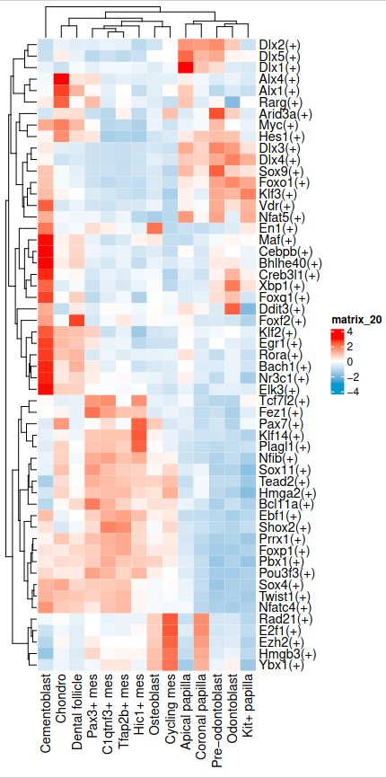
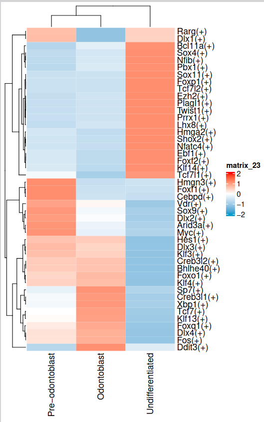

# Downstream analysis of SCENIC
## Introduction
The downstream analysis of SCENIC (Single-Cell Regulatory Network Inference and Clustering) is a crucial step in understanding the regulatory networks and gene expression patterns in single-cell RNA sequencing data. This analysis aims to identify key regulators, their target genes, and the interactions between them, providing insights into the biological processes and cell states within a sample. The SCENIC pipeline integrates gene expression data with regulatory network inference to identify regulons, which are sets of genes co-regulated by a transcription factor.

## Input and Output
The input for this analysis is a single-cell RNA sequencing dataset, which is processed through the SCENIC pipeline to generate a regulon activity matrix. This matrix represents the activity of each regulon across different cells in the dataset. The output of this analysis includes the identification of top regulons, their associated genes, and the visualization of their expression patterns across different cell clusters. The results provide a comprehensive understanding of the regulatory networks governing cell behavior and can be used to inform further biological investigations.

## Process
```R
auc <- data.table::fread("process/regulon/lzs_scenic_3/auc_mtx.csv")
auc <- auc %>% column_to_rownames("V1")
auc <- t(auc)
auc <- auc[,colnames(mes)]
auc_assay <- CreateAssayObject(counts = auc)

mes <- readRDS("processed_data/integrated_data/20241125_mes_var.Rds")
mes@assays$auc <- auc_assay

Idents(mes) <- mes$C19_named
DefaultAssay(mes) <- "auc"
aucMarker <- FindAllMarkers(mes,min.pct = 0.01,logfc.threshold = 0.01,only.pos = T)

averageAuc <- AverageExpression(mes,assays = "auc")
averageAuc<- averageAuc$auc
averageAuc <- averageAuc %>% as.data.frame()

thred = 0.1
hmMax <- rowMax(as.matrix(averageAuc))
regulons <- rownames(averageAuc)[hmMax>thred]

topAucMarker <- aucMarker %>%
  arrange(cluster)%>%
  filter(avg_log2FC>0.02)%>%
  filter(gene %in% regulons) %>%
  group_by(cluster) %>%
  slice_head(n = 10)
topAucMarker%<>%ungroup()%>%
  dplyr::select(gene)%>%
  unlist() %>% unique


findTopRegulons <- function(mes, threshold = 0.1, min_pct = 0.01, logfc_threshold = 0.01,
                            avg_log2FC_threshold = 0.02, top_n = 10) {
  # Find markers
  aucMarker <- FindAllMarkers(mes,
                              min.pct = min_pct,
                              logfc.threshold = logfc_threshold,
                              only.pos = TRUE)

  # Calculate average expression
  averageAuc <- AverageExpression(mes, assays = "auc")
  averageAuc <- averageAuc$auc
  averageAuc <- averageAuc %>% as.data.frame()

  # Find regulons above threshold
  hmMax <- rowMax(as.matrix(averageAuc))
  regulons <- rownames(averageAuc)[hmMax > threshold]

  # Find top markers
  topAucMarker <- aucMarker %>%
    arrange(cluster) %>%
    filter(avg_log2FC > avg_log2FC_threshold) %>%
    filter(gene %in% regulons) %>%
    group_by(cluster) %>%
    slice_head(n = top_n) %>%
    ungroup() %>%
    dplyr::select(gene) %>%
    unlist() %>%
    unique()

  # Return results as a list
  return(list(
    marker = aucMarker,
    averageAuc = averageAuc,
    topAucMarker = topAucMarker
  ))
}

# Usage:
# results <- findTopRegulons(mes)
# averageAuc <- results$averageAuc
# topAucMarker <- results$topAucMarker

#== plot all clusters heatmap-------------
hmData <- averageAuc[topAucMarker,]
hmDataScale <- t(scale(t(hmData)))

pdf("results/regulation/20241215_scenic_auc/20241215_cluster_hm.pdf",width = 5,height = 10)
Heatmap(hmDataScale,cluster_columns = T,cluster_rows = T,col=colorRamp2(c(-3, 0, 3), c("DeepSkyBlue3", "white", "red")))
dev.off()


Heatmap(hmData,cluster_columns = F,cluster_rows = F)
#intersect(auc %>% rownames(), mes %>% colnames) %>% length

#== Focus on terminal cell state--------------------
mesSub <- mes[,mes$C19_named%in%c("Hic1+ mes", "Pax3+ mes", "Coronal papilla",
                               "Dental follicle", "Tfap2b+ mes", "Cycling mes", "C1qtnf3+ mes",
                               "Odontoblast",  "Apical papilla", "Pre-odontoblast")]

mesSub$odontoLabel <- mesSub$C19_named
mesSub$odontoLabel[mesSub$C19_named%in%c("Hic1+ mes", "Pax3+ mes", "Coronal papilla",
                                      "Dental follicle", "Tfap2b+ mes", "Cycling mes", "C1qtnf3+ mes",
                                      "Apical papilla")] <- "Undifferentiated"
Idents(mesSub) <- mesSub$odontoLabel

results <- findTopRegulons(mesSub,top_n = 20)
averageAucSub <- results$averageAuc
topAucMarkerSub <- results$topAucMarker

hmData <- averageAucSub[topAucMarkerSub,]
hmDataScale <- t(scale(t(hmData)))
pdf("results/regulation/20241215_scenic_auc/20241215_cluster_hm_odondo.pdf",width = 5,height = 8)
Heatmap(hmDataScale,cluster_columns = T,cluster_rows = T,col=colorRamp2(c(-2, 0, 2), c("DeepSkyBlue3", "white", "red")))
dev.off()

submarker <- results$marker
write.csv(aucMarker,"process/regulon/scenic_downstream/20241215_regulon_all_cluster.csv")
write.csv(submarker,"process/regulon/scenic_downstream/20241215_regulon_odonto.csv")
write.csv(results$averageAuc,"process/regulon/scenic_downstream/20241215_aucMat_odonto.csv")
write.csv(averageAuc,"process/regulon/scenic_downstream/20241215_aucMat_all_cluster.csv")
```

## Results


