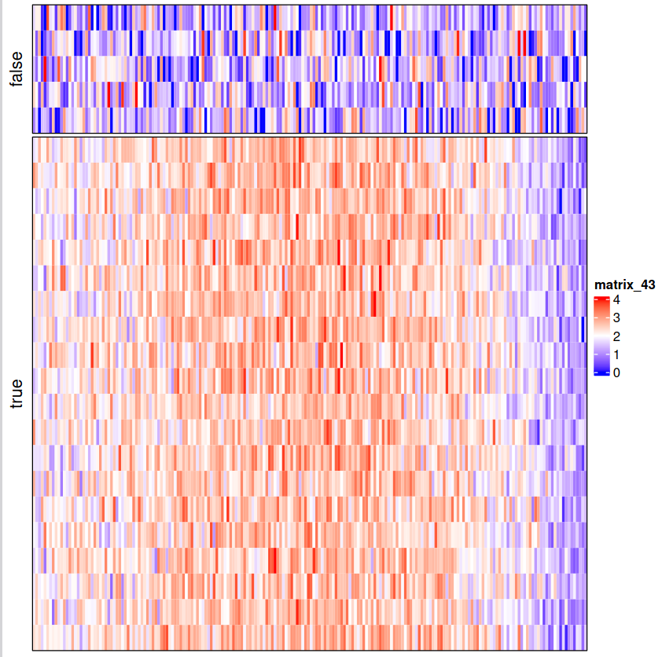

# Simulate datasets 1

This document provides a vignette of simulated datasets to validate our model. We will see whether our model can distinguish the true signal and false signal.

## Generate simulated data

First, we define a function to generate simulated data with the following parameters:

- `n_true_arrays`: Number of arrays with true signal (default 20)
- `n_noise_arrays`: Number of arrays with pure noise (default 5) 
- `n_positions`: Number of positions along trajectory (default 100)
- `base_expression`: Base expression level (default 3)
- `signal_strength`: Strength of the true signal pattern (default 2)
- `signal_noise_sd`: Standard deviation of noise added to true signal (default 0.5)
- `overdispersion`: Overdispersion parameter (default 4)
- `noise_sd`: Standard deviation of pure noise arrays (default 1)

The function generates:
1. A true signal pattern using a cubic polynomial
2. Arrays with true signal + noise
3. Arrays with pure random noise

```R

generate_simulation_data <- function(
    n_true_arrays = 20,
    n_noise_arrays = 5,
    n_positions = 100,
    base_expression = 3,
    signal_strength = 2,
    signal_noise_sd = 0.5,
    overdispersion =4 ,  # different overdispersion levels
    noise_sd = 1,  # standard deviation for Gaussian noise
    seed = 123
) {
  set.seed(seed)

  n_total_arrays <- n_true_arrays + n_noise_arrays

  # Generate position vector
  x <- seq(0, 1, length.out = n_positions)

  # Create polynomial signal pattern
  true_signal <- base_expression +
    signal_strength * (-x^3 + 0.5*x^2 + 0.3*x)  # cubic polynomial

  # Ensure signal is positive
  true_signal <- true_signal - min(true_signal) + 1

  # Create empty matrix
  sim_data <- matrix(
    NA,
    nrow = n_total_arrays,
    ncol = n_positions,
    dimnames = list(
      paste0("Array", 1:n_total_arrays),
      paste0("Pos", 1:n_positions)
    )
  )

  # Generate true signal arrays (1:20)
  for(i in 1:n_true_arrays) {
    # Add random noise to the true signal
    noisy_signal <- true_signal + rnorm(n_positions, mean = 0, sd = signal_noise_sd)
    # Ensure positivity
    noisy_signal <- pmax(noisy_signal, 0)
    sim_data[i, ] <- noisy_signal
  }

  # Generate pure noise arrays (21:25)
  for(i in (n_true_arrays + 1):n_total_arrays) {
    # Pure random Gaussian noise around base expression
    sim_data[i, ] <- pmax(rnorm(n_positions,
                           mean = base_expression,
                           sd = noise_sd),0)
  }

  return(list(
    data = sim_data,
    x = x,
    true_signal = true_signal,
    true_arrays = 1:n_true_arrays,
    noise_arrays = (n_true_arrays + 1):n_total_arrays
  ))
}
```


## Validation Results

We generated simulated data with:
- Base expression = 1.5
- Signal strength = 5 
- 200 positions
- 20 true signal arrays
- 5 noise arrays


### Heatmap Visualization
The heatmap shows the simulated data matrix with true signal arrays and noise arrays separated.




```R
simuData <- generate_simulation_data(base_expression = 1.5,signal_strength=5,n_positions=200)
plot(simuData$true_signal)
#trueCol = c(rep("true",20), rep("false",5))
#getwd()
pdf("results/trajectory/20241210_conserved_model_validation/20241210_simudata1_heatmap.pdf")
Heatmap(simuData$data,cluster_rows = F,cluster_columns = F,show_column_names =  F, show_row_names = F,
        col=colorRamp2(c(0, 2, 4), c("blue", "white", "red")),split =  trueCol,border = T)
dev.off()
```

### Model Fitting Results

```R

formDataset <- function(dataMat,y){
  x = simuData$data %>%  t() %>% as.vector()
  y = rep(simuData$x,25)
  i = rep(1:25,each=200)
  return(list(x,y,i))
}
inputDat <- formDataset(simuData$data,simuData$x)
fit <- bayesian_gam_regression_nb_shape(x = inputDat[[2]],y = inputDat[[1]],array_idx = inputDat[[3]])

plot(inputDat[[2]][1:100],inputDat[[1]][1:100])

pdf("results/trajectory/20241210_conserved_model_validation/20241210_simudata1_valide.pdf")
fit$array_weights$Estimate %>% plot(xlab = "Array index",
                                    ylab = "phi",
                                    main = "Simulate datasets")
dev.off()

p <- plot_results_brms(fit)
ggsave(plot = p, "results/trajectory/20241210_conserved_model_validation/20241210_validate.pdf",width = 10,height = 3)

plot_fit <- function(fit) {
  # Extract data
  df <- fit$data


  # Plot 2: Data and fitted curve
  # Generate prediction data
  x_seq <- seq(min(df$x), max(df$x), length.out = 100)
  pred_data <- data.frame(
    x = x_seq,
    # Use the first array for predictions
    array = factor(rep(levels(df$array)[1], 100))
  )

  # Get predictions
  predictions <- predict(fit$fit, newdata = pred_data)

  pred_df <- data.frame(
    x = x_seq,
    y = predictions[,"Estimate"],
    lower = predictions[,"Q2.5"],
    upper = predictions[,"Q97.5"]
  )

  # Create the second plot
  p2 <- ggplot() +
    # Original data points
    geom_point(data = df,
               aes(x = x, y = y, color = array,
                   alpha = fit$array_weights$weight_norm[as.numeric(array)])) +
    # Fitted line
    geom_line(data = pred_df,
              aes(x = x, y = y),
              color = "red",
              size = 1) +
    # Confidence interval
    geom_ribbon(data = pred_df,
                aes(x = x, ymin = lower, ymax = upper),
                alpha = 0.2,
                fill = "red") +
    labs(title = "Data and Fitted GAM",
         x = "X",
         y = "Y") +
    theme_minimal() +
    theme(legend.position = "none")

  # Arrange plots
  p2
}

p1 <- plot_fit(fit = fit)+coord_cartesian(ylim = c(0, 6))


df <- data.frame(x = simuData$x, value = simuData$true_signal)
p2 <- ggplot(df, aes(x = x, y = value)) +
    geom_line() +
    theme_minimal() +
    labs(title = "True Signal Pattern",
         x = "Position",
         y = "Signal Value")+
    coord_cartesian(ylim = c(0, 6))
p1+p2

ggsave("results/trajectory/20241210_conserved_model_validation/20241210_simu1_plotfit.pdf",width = 10,height = 4)
```

We fit the Bayesian GAM model to the simulated data. The model successfully:

1. Identified arrays containing true signal vs noise through the phi parameter


2. Recovered the underlying signal pattern


3. Comparison between fitted curve and true signal


The results demonstrate that:
- The model can effectively distinguish between arrays containing true signal and pure noise
- The fitted curve closely matches the true underlying signal pattern
- The confidence intervals appropriately capture the uncertainty in the fit

This validation confirms that our Bayesian model framework can successfully:
1. Identify and weight informative arrays
2. Reconstruct the true signal pattern
3. Handle noise and overdispersion appropriately
