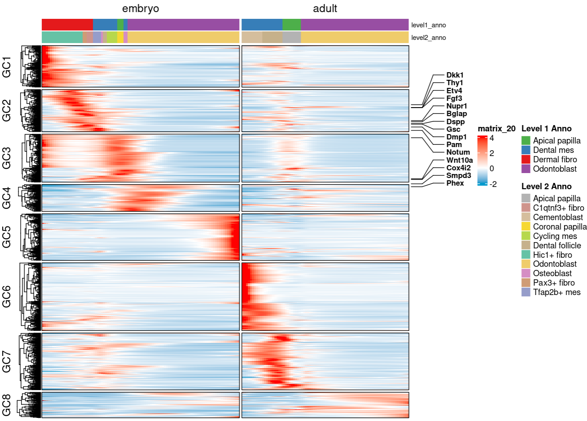

# Trajectory Analysis of Gene Expression using tradeSeq

## Introduction

This document outlines the trajectory analysis of tooth mesenchyme development using the `tradeSeq` package. Trajectory inference is a computational approach that orders cells along a continuum of developmental states, allowing us to study gene expression dynamics during differentiation processes. This analysis specifically examines the developmental trajectories from embryonic to adult stages in tooth mesenchyme cells, identifying genes that show significant expression changes along these trajectories.

The `tradeSeq` (TRAjectory Differential Expression analysis for SEQuencing data) package fits generalized additive models (GAMs) to gene expression data along pseudotime trajectories. Unlike traditional differential expression analysis that compares discrete cell groups, trajectory analysis captures continuous changes in gene expression patterns, revealing the dynamics of developmental processes.

## Purpose

The main goals of this analysis are:

1. Identify genes that show significant expression changes along tooth mesenchyme developmental trajectories
2. Compare gene expression patterns between embryonic and adult lineages
3. Cluster genes with similar expression dynamics into functional modules
4. Integrate gene expression patterns with cell type annotations to understand developmental progression
5. Highlight known marker genes relevant to tooth development and odontogenesis

## Input Data

This analysis requires the following input files:

1. **Seurat Object** (`processed_data/integrated_data/20250326_mesenchyme.Rds`): 
   - Contains integrated tooth mesenchyme single-cell RNA-seq data
   - Includes cell metadata and expression matrices

2. **Pseudotime Values** (`processed_data/trajectory/20241124_pseudotime_predicted.csv`):
   - Cell-level pseudotime predictions, used to order cells along developmental trajectories

3. **Highly Variable Genes** (`processed_data/framework/20250327_mes_hvg_2000.csv`):
   - List of 2000 highly variable genes to focus the analysis on biologically relevant features

4. **Metadata** (`data/metadata/20250326_metadata.csv`):
   - Sample annotations including histology information

## Method Overview

The analysis workflow consists of the following key steps:

1. **Data Preparation**:
   - Loading the Seurat object, pseudotime values, and metadata
   - Defining embryonic and adult cell populations
   - Creating cell weight and pseudotime matrices for tradeSeq

2. **Trajectory Modeling**:
   - Evaluating optimal number of knots for GAM fitting
   - Fitting generalized additive models to gene expression data along pseudotime
   - Handling batch effects with a design matrix

3. **Differential Expression Analysis**:
   - Performing association tests to identify genes that vary significantly along trajectories
   - Identifying lineage-specific differentially expressed genes
   - Visualizing gene set overlaps between lineages

4. **Expression Pattern Visualization**:
   - Predicting smoothed expression patterns along pseudotime
   - Interpolating expression values to create a uniform time grid
   - Scaling expression values for visualization

5. **Gene Clustering and Annotation**:
   - Clustering genes with similar expression patterns using k-means
   - Associating cell type annotations with pseudotime positions
   - Creating comprehensive heatmaps with biological annotations
   - Highlighting developmentally relevant marker genes

## Output Files

The analysis generates the following output files:

1. **GAM Model** (`processed_data/trajectory/traj_gene/20250327_gam.Rds`):
   - Fitted generalized additive model object for future analysis

2. **Upset Plot** (`results/trajectory/20250327_tradeseq/20250327_upset.pdf`):
   - Visualization of gene set overlaps between embryonic and adult lineages

3. **Gene Expression Heatmap** (`results/trajectory/20250327_tradeseq/20241021_gene_traj.pdf`):
   - Comprehensive heatmap showing:
     - Clustered gene expression patterns along pseudotime
     - Cell type annotations
     - Highlighted marker genes
     - Expression modules (gene clusters)


## Notes and Considerations

### Computational Requirements
- This analysis is computationally intensive, especially for the GAM fitting step
- Parallelization is used where possible (via BiocParallel)
- Downsampling of cells may be necessary for very large datasets

### Parameter Selection
- The number of knots (k=6) affects the flexibility of the fitted curves
- The significance threshold (FDR ≤ 0.01) determines which genes are considered differentially expressed
- The number of clusters (k=8) groups genes with similar expression patterns

### Limitations
- Pseudotime is an approximation of the real developmental timeline
- Results are sensitive to the quality of the input pseudotime values
- Batch effects may influence gene expression patterns

### Customization
- The gene list for highlighting (`gene_list`) can be modified to focus on genes of interest
- Color schemes, cluster ordering, and annotations can be adjusted as needed
- The analysis can be extended to include additional trajectories or conditions

## Process

```R
## Tradeseq
library(Seurat)
library(ggplot2)
library(RColorBrewer)
library(destiny)
library(lattice)
library(tradeSeq)
library(tidyverse)
library(ComplexHeatmap)
library(circlize)
library(BiocParallel)
library(UpSetR)
source("../function/seurat_utils.R")

# Set random seed for reproducibility
set.seed(42)

# Load data
seurat <- readRDS("processed_data/integrated_data/20250326_mesenchyme.Rds")
pseudotime <- read.csv("processed_data/trajectory/20241124_pseudotime_predicted.csv", row.names = 1)
varGeneMes <- read.csv("processed_data/framework/20250327_mes_hvg_2000.csv", row.names = 1) %>% unlist()

# Read and process metadata
metadata <- read.csv("data/metadata/20250326_metadata.csv", row.names = 1)
metadata <- metadata[rownames(metadata) %in% seurat$Sample, ]
metaAnno <- unique(metadata[c("Project", "Histology")])
histology_lookup <- setNames(metaAnno$Histology, metaAnno$Project)
seurat$Histology <- histology_lookup[match(seurat$Project, names(histology_lookup))]

# Extract metadata for analysis
scMeta <- seurat@meta.data
scMeta <- scMeta[rownames(pseudotime),]

# Define embryo vs adult cells
seurat$embryo_or_adult <- ifelse(seurat$Stage %in% c("Embryo"), "Embryo", "Adult")
cells1 <- colnames(seurat)[seurat$embryo_or_adult == "Embryo"]
cells2 <- colnames(seurat)[seurat$embryo_or_adult == "Adult"]

# Create cell weights matrix for tradeSeq
cellsCol <- data.frame(row.names = colnames(seurat))
cellsCol$embryo <- as.integer(colnames(seurat) %in% cells1)
cellsCol$adult <- as.integer(colnames(seurat) %in% cells2)

# Create pseudotime matrix
pseudotimeCol <- data.frame(row.names = colnames(seurat))
pseudotimeCol$embryo <- pseudotimeCol$adult <- pseudotime$lightGBM

# Configure parallel processing
BPPRARM <- BiocParallel::bpparam()
BPPRARM$workers <- 10

# Prepare count matrix and batch effect matrix
batch <- factor(seurat$Sample)
U <- model.matrix(~batch)
count <- seurat@assays$originalexp@counts
count <- count[unlist(varGeneMes),]
saveRDS(count, "../202409_tooth_raw/tmp/20250326_mescount.Rds")

# Evaluate optimal number of knots
icMat <- evaluateK(counts = seurat@assays$originalexp@counts,
                  pseudotime = pseudotimeCol,
                  cellWeights = cellsCol,
                  k = 4:8,
                  parallel = TRUE,
                  nGenes = 100,
                  BPPARAM = BPPRARM,
                  verbose = TRUE)

# Handle NA values in pseudotime
pseudotimeCol[is.na(pseudotimeCol)] <- 0

# Downsample cells for computational efficiency
set.seed(123) # Ensure reproducible downsampling
downsampled_cell <- sample(colnames(count), min(50000, ncol(count)))

# Fit GAM model
gam <- fitGAM(counts = count[, downsampled_cell],
              pseudotime = pseudotimeCol[downsampled_cell, ],
              cellWeights = cellsCol[downsampled_cell, ],
              nknots = 6,
              U = U[colnames(count) %in% downsampled_cell, ],
              parallel = TRUE,
              genes = varGeneMes,
              BPPARAM = BPPRARM,
              verbose = TRUE)

# Save GAM model
saveRDS(gam, "processed_data/trajectory/traj_gene/20250327_gam.Rds")

# Perform association test
rowData(gam)$assocRes <- associationTest(gam, lineages = TRUE, l2fc = log2(2))
assocRes <- rowData(gam)$assocRes

# Identify significant genes for each lineage (FDR <= 0.01)
line1Genes <- rownames(assocRes)[which(p.adjust(assocRes$pvalue_1, "fdr") <= 0.01)]
line2Genes <- rownames(assocRes)[which(p.adjust(assocRes$pvalue_2, "fdr") <= 0.01)]

# Create upset plot to visualize overlaps
pdf("results/trajectory/20250327_tradeseq/20250327_upset.pdf")
upset(fromList(list(line1 = line1Genes, line2 = line2Genes)))
dev.off()

# Predict smoothed expression
geneUnion <- unique(c(line1Genes, line2Genes))
yhatSmoothAll <- predictSmooth(gam, gene = geneUnion, nPoints = 100, tidy = FALSE)
yhatSmoothAllTidy <- predictSmooth(gam, gene = geneUnion, nPoints = 100, tidy = TRUE)

# Create time grid for interpolation
time_grid <- seq(min(yhatSmoothAllTidy$time), max(yhatSmoothAllTidy$time), length.out = 100)

# Function to interpolate and handle missing values
interpolate_with_nan <- function(data, new_time) {
  min_time <- min(data$time)
  max_time <- max(data$time)
  interp_values <- approx(data$time, data$yhat, xout = new_time, method = "linear", rule = 1)$y
  interp_values[new_time < min_time | new_time > max_time] <- NaN
  return(interp_values)
}

# Process the data for visualization
result <- yhatSmoothAllTidy %>%
  group_by(lineage, gene) %>%
  group_modify(~ data.frame(time = time_grid,
                           yhat = interpolate_with_nan(., time_grid))) %>%
  ungroup()

# Create 3D array for heatmap
genes <- unique(yhatSmoothAllTidy$gene)
lineages <- unique(yhatSmoothAllTidy$lineage)
array_3d <- array(NaN, dim = c(100, length(genes), length(lineages)))

for (i in seq_along(lineages)) {
  for (j in seq_along(genes)) {
    subset_data <- result %>%
      filter(lineage == lineages[i], gene == genes[j])
    array_3d[, j, i] <- subset_data$yhat
  }
}

# Name the dimensions
dimnames(array_3d) <- list(
  time = time_grid,
  gene = genes,
  lineage = lineages
)

# Prepare matrices for heatmap
mat1 <- t(array_3d[,,1])
mat2 <- t(array_3d[,,2])
mat <- cbind(mat1, mat2)

# Custom row scaling function that preserves NaN
scale_rows_preserve_nan <- function(x) {
  row_means <- rowMeans(x, na.rm = TRUE)
  row_sds <- apply(x, 1, sd, na.rm = TRUE)
  means_matrix <- matrix(row_means, nrow = nrow(x), ncol = ncol(x))
  sds_matrix <- matrix(row_sds, nrow = nrow(x), ncol = ncol(x))
  scaled_mat <- (x - means_matrix) / sds_matrix
  scaled_mat[is.nan(x)] <- NaN
  return(scaled_mat)
}

# Apply the custom scaling function
scaled_mat <- scale_rows_preserve_nan(mat)

# Remove rows with any NaN values for k-means clustering
set.seed(1234) # Ensure reproducible clustering
scaled_mat_no_nan <- scaled_mat[, colSums(is.na(scaled_mat)) == 0]

# Perform k-means clustering
k <- 8  # Number of clusters
km <- kmeans(scaled_mat_no_nan, centers = k, nstart = 25)

# Create a vector of cluster assignments for all rows
cluster_assignments <- km$cluster

# Create column split factor
column_split <- rep(c("embryo", "adult"), each = 100)
column_split <- factor(column_split, levels = c("embryo", "adult"))

# Create the heatmap with clustering results and column split
hmAll <- Heatmap(scaled_mat,
                 cluster_columns = FALSE,
                 show_column_names = FALSE,
                 show_row_names = FALSE,
                 row_split = cluster_assignments,
                 column_split = column_split,
                 col = colorRamp2(c(-2, 0, 4), c("Deepskyblue3", "white", "red")),
                 na_col = "grey",
                 border = TRUE)

hmAll <- draw(hmAll)

# Extract metadata for lineage analysis
meta <- scMeta[c("Histology", "C9_named", "C19_named")]

# Get cells for each lineage
lineage1Cell <- rownames(cellsCol)[cellsCol$embryo == 1]
lineage2Cell <- rownames(cellsCol)[cellsCol$adult == 1]

# Prepare metadata for each lineage
meta1 <- meta[lineage1Cell,]
meta1$pseudo <- pseudotimeCol[lineage1Cell,]$embryo
meta2 <- meta[lineage2Cell,]
meta2$pseudo <- pseudotimeCol[lineage2Cell,]$adult

# Function to process metadata by time intervals
process_metadata <- function(meta_df, time_grid) {
  # Process the metadata
  new_meta <- meta_df %>%
    mutate(time_interval = findInterval(pseudo, time_grid)) %>%
    group_by(time_interval) %>%
    summarise(
      max_level1_anno = names(which.max(table(C9_named))),
      max_level2_anno = names(which.max(table(C19_named))),
      max_hist = names(which.max(table(Histology))),
      pseudo_time = mean(pseudo)
    ) %>%
    arrange(time_interval)

  # Create a complete set of time intervals from 1 to 100
  complete_intervals <- tibble(time_interval = 1:100)

  # Join the processed metadata with the complete set of intervals
  final_meta <- complete_intervals %>%
    left_join(new_meta, by = "time_interval") %>%
    mutate(
      max_level1_anno = if_else(is.na(max_level1_anno), NA_character_, max_level1_anno),
      max_level2_anno = if_else(is.na(max_level2_anno), NA_character_, max_level2_anno),
      max_hist = if_else(is.na(max_hist), NA_character_, max_hist)
    )

  return(final_meta)
}

# Process metadata for both lineages
new_meta1 <- process_metadata(meta1, time_grid)
new_meta2 <- process_metadata(meta2, time_grid)
new_meta <- rbind(new_meta1, new_meta2)

# Function to create a color mapping that includes gray for NA
create_color_map <- function(values, palette_name = "Set1") {
  unique_values <- unique(values[!is.na(values)])
  n_colors <- length(unique_values)

  if (n_colors == 0) {
    return(c("NA" = "gray"))
  } else if (n_colors == 1) {
    colors <- brewer.pal(3, palette_name)[1]
  } else if (n_colors == 2) {
    colors <- brewer.pal(3, palette_name)[1:2]
  } else if (n_colors <= 8) {
    colors <- brewer.pal(n_colors, palette_name)
  } else {
    colors <- colorRampPalette(brewer.pal(8, palette_name))(n_colors)
  }

  color_map <- setNames(colors, unique_values)
  if (any(is.na(values))) {
    color_map <- c(color_map, "NA" = "gray")
  }
  return(color_map)
}

# Create color mappings for annotations
level1_anno_colors <- create_color_map(new_meta$max_level1_anno, "Set1")
level2_anno_colors <- create_color_map(new_meta$max_level2_anno, "Set2")
hist_colors <- create_color_map(new_meta$max_hist, "Set3")

# Create heatmap with annotations
hmAll <- Heatmap(scaled_mat[,4:182],
                 cluster_columns = FALSE,
                 show_column_names = FALSE,
                 show_row_names = FALSE,
                 row_split = cluster_assignments,
                 column_split = column_split[4:182],
                 col = colorRamp2(c(-2, 0, 4), c("Deepskyblue3", "white", "red")),
                 border = TRUE,
                 na_col = "grey",
                 top_annotation = HeatmapAnnotation(
                   level1_anno = new_meta$max_level1_anno[4:182],
                   level2_anno = new_meta$max_level2_anno[4:182],
                   annotation_name_gp = gpar(fontsize = 8),
                   annotation_legend_param = list(
                     level1_anno = list(title = "Level 1 Anno"),
                     level2_anno = list(title = "Level 2 Anno")
                   ),
                   col = list(
                     level1_anno = level1_anno_colors,
                     level2_anno = level2_anno_colors
                   )
                 ))

hmAll <- draw(hmAll)

# Define cluster order and names for final visualization
cluster_order <- c(3, 2, 7, 4, 5, 1, 6, 8)
new_cluster_names <- paste0("GC", 1:8)

# Create a named vector for renaming
rename_vector <- setNames(new_cluster_names, cluster_order)

# Reorder and rename the cluster assignments
sigGene_ordered <- factor(cluster_assignments, levels = cluster_order)
levels(sigGene_ordered) <- rename_vector[levels(sigGene_ordered)]

# Define genes of interest to highlight
gene_list <- c("Smpd3", "Dspp", "Dmp1", "Phex", "Cox4i2",
               "Nupr1", "Bglap", "Gsc", "Wnt10a",
               "Fgf3", "Sall1", "Notum", "Thy1", "Etv4",
               "Dkk1", "Frmd5", "Mpped1", "Pam")

# Find genes that exist in our dataset
labelsT <- intersect(gene_list, geneUnion)

# Get positions of genes to highlight
position <- sapply(labelsT, function(gene) which(rownames(scaled_mat) == gene))

# Create row annotation with gene labels
har <- rowAnnotation(link = anno_mark(at = position, labels = labelsT,
                                     labels_gp = gpar(fontsize = 9, fontface = "bold"), 
                                     link_width = unit(1.5, "cm")))

# Create final heatmap and save to PDF
pdf("results/trajectory/20250327_tradeseq/20241021_gene_traj.pdf", width = 10, height = 8)
hmAll <- Heatmap(scaled_mat[,4:182],
                 cluster_columns = FALSE,
                 show_column_names = FALSE,
                 show_row_names = FALSE,
                 cluster_row_slices = FALSE,
                 row_split = sigGene_ordered,
                 column_split = column_split[4:182],
                 col = colorRamp2(c(-2, 0, 4), c("Deepskyblue3", "white", "red")),
                 border = TRUE,
                 na_col = "grey",
                 right_annotation = har,
                 top_annotation = HeatmapAnnotation(
                   level1_anno = new_meta$max_level1_anno[4:182],
                   level2_anno = new_meta$max_level2_anno[4:182],
                   annotation_name_gp = gpar(fontsize = 8),
                   annotation_legend_param = list(
                     level1_anno = list(title = "Level 1 Anno"),
                     level2_anno = list(title = "Level 2 Anno")
                   ),
                   col = list(
                     level1_anno = level1_anno_colors,
                     level2_anno = level2_anno_colors
                   )
                 ))
hmAll <- draw(hmAll)
dev.off()
```