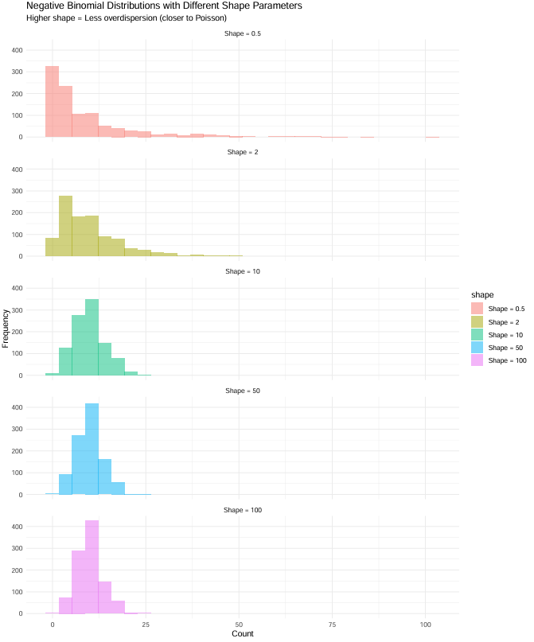

# Shape parameter (φ) in NB
## Introduction
The negative binomial (NB) distribution is widely used for modeling count data, especially in genomics where it effectively captures the overdispersion commonly observed in gene expression data. In this tutorial, we'll explore the shape parameter (φ) of the NB distribution and its relationship to data variation.

## Negative Binomial Distribution Basics
The negative binomial distribution has two key parameters:

- μ (mu): The mean
- φ (phi): The shape parameter

The variance of a negative binomial distribution is defined as:
$$\text{Var}(Y) = \mu + \frac{\mu^2}{\phi}$$

This relationship shows that:

When φ is large, the variance approaches μ (similar to Poisson distribution)

When φ is small, the variance becomes much larger than μ (overdispersion)

## Overdispersion and Shape Parameter
Overdispersion occurs when the variance of data exceeds what would be expected from a Poisson distribution (where variance equals mean). In gene expression data, overdispersion is common due to biological and technical variability.

Key insights:

- Higher φ values → Less overdispersion → Data closer to Poisson
- Lower φ values → More overdispersion → Greater variability around the mean
- φ is sometimes referred to as the "dispersion parameter" (although technically it's the inverse of dispersion)

## Visual Demonstration with R

Let's examine different shape parameters visually:

```r
# Generate data with different shape parameters
generate_nb_data <- function(n = 1000, mean_value = 10) {
  shapes <- c(0.5, 2, 10, 50, 100)  # from high to low overdispersion
  
  data <- lapply(shapes, function(shape) {
    rnbinom(n, mu = mean_value, size = shape)
  })
  
  data.frame(
    value = unlist(data),
    shape = rep(paste("Shape =", shapes), each = n)
  )
}

# Generate and plot data
data <- generate_nb_data()
```

### Distribution Comparison

When plotting these distributions, we observe:

- **Shape = 0.5**: Highly skewed with a long tail, showing extreme overdispersion
- **Shape = 2**: Still overdispersed but less extreme
- **Shape = 10**: Moderate overdispersion
- **Shape = 50**: Slight overdispersion
- **Shape = 100**: Nearly Poisson-like distribution

### Variance-Mean Ratio Analysis

For each shape value, we can calculate:

```r
summary_stats <- data %>%
  group_by(shape) %>%
  summarise(
    mean = mean(value),
    variance = var(value),
    variance_mean_ratio = var(value)/mean(value)
  )
```

Results typically show:
- Shape = 0.5: Variance/mean ratio ≈ 20-30
- Shape = 2: Variance/mean ratio ≈ 5-7 
- Shape = 10: Variance/mean ratio ≈ 2
- Shape = 50: Variance/mean ratio ≈ 1.2
- Shape = 100: Variance/mean ratio ≈ 1.1



## Application in TrajConserve

In TrajConserve, we leverage the shape parameter to quantify conservation across trajectories:

$$y \sim \text{NegativeBinomial}(\mu, \phi)$$
$$\log(\mu) = s(x) + \text{array}$$
$$\phi = \phi_{\text{array}}$$

Where:
- Higher φ values indicate more conserved expression patterns
- Array-specific φ parameters capture trajectory-specific conservation
- Conservation scores incorporate both the mean and variance of φ

## Modeling with the Shape Parameter

The shape parameter can be:

1. **Estimated from data**: Let the model determine the best φ value
   ```r
   model_free <- brm(
     counts ~ s(x, bs = "cr"),
     data = test_data,
     family = negbinomial()
   )
   ```

2. **Modeled with covariates**: Allow φ to vary based on batch/array
   ```r
   model_fixed <- brm(
     bf(counts ~ s(x, bs = "cr"),
        shape ~ 0 + array),  # Array-specific shapes
     data = test_data,
     family = negbinomial()
   )
   ```

## Practical Tips for Working with Shape Parameters

1. **Interpretation**: Higher shape = more reliable data = less overdispersion
2. **Model selection**: Compare models with fixed vs. varying shape parameters
3. **Diagnostics**: Check residual patterns to ensure appropriate shape modeling
4. **Conservation analysis**: Use shape parameters to identify genes with consistent expression patterns across conditions

## Conclusion

The shape parameter in negative binomial distributions provides valuable information about data variability. In trajectory analysis, it serves as a powerful tool for quantifying conservation across different conditions or cell types. Understanding this parameter helps researchers better interpret gene expression dynamics along developmental trajectories.

---

*Note: This tutorial is based on the R package TrajConserve, which implements Bayesian Generalized Additive Models with negative binomial distribution for analyzing trajectory conservation in single-cell RNA sequencing data.*