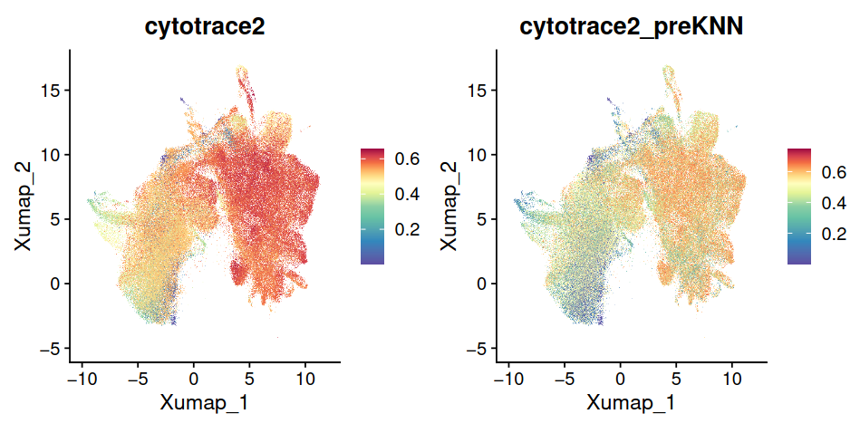
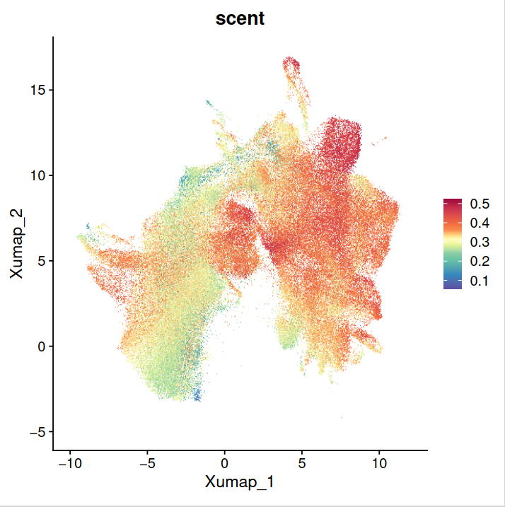

# Stemness and Start Point Inference

## Introduction
Determining the starting point of a trajectory presents a significant challenge, especially when working with integrated datasets. To address this, we can leverage key biological indicators such as cellular age and developmental potential. In this section, we will employ multiple computational methods including Cytotrace2 {cite:p}`kangMappingSinglecellDevelopmental2024`, Cytotrace {cite:p}`gulatiSinglecellTranscriptionalDiversity2020`, and SCENT {cite:p}`teschendorffSinglecellEntropyAccurate2017` to systematically infer the developmental potential of cells and identify suitable trajectory starting points.

## Cytotrace2

```R
library(tidyverse)
library(CytoTRACE2)
library(RColorBrewer)
#devtools::install("~/soft/cytotrace2/cytotrace2_r/")

devtools::install_github("digitalcytometry/cytotrace2", subdir = "cytotrace2_r")
mes <- readRDS("processed_data/integrated_data/20241106_mesenchyme.Rds")
cellName <- read.csv("processed_data/framework/attributeName/cellName_mes_keep20241119.csv",row.names = 1) %>% unlist()
mes <- mes[,cellName]
loadData_fromSeurat <- function (object, slot_type,assay)
{
  data <- as.data.frame(Seurat::GetAssayData(object = object,
                                             assay = "originalexp", slot = slot_type))
  return(data)
}

cytotrace2_result <- cytotrace2(mes, is_seurat = TRUE, slot_type = "data", species = 'mouse',assay = "originalexp")

test <- loadData_fromSeurat(mes,slot_type = "data",assay = "originalexp")

cytotrace2_result <- cytotrace2(test)
mes$cytotrace2 <- cytotrace2_result$CytoTRACE2_Score

FeaturePlot(mes,"cytotrace2")+scale_colour_gradientn(colours = rev(brewer.pal(n = 11, name = "Spectral")),
                                                     values = c(0,0.4,0.55,0.65,1.0))
ggsave("results/trajectory/20241124_multipotent/20241124_cytotrace2_score.pdf",width = 6,height = 6)

mes$cytotrace2_preKNN <- cytotrace2_result$preKNN_CytoTRACE2_Score
FeaturePlot(mes,"cytotrace2_preKNN")+scale_colour_gradientn(colours = rev(brewer.pal(n = 11, name = "Spectral")),
                                                     values = c(0,0.4,0.55,0.65,1.0))
ggsave("results/trajectory/20241124_multipotent/20241124_cytotrace2_score_preknn.pdf",width = 6,height = 6)
write.csv(cytotrace2_result,"process/trajectory/20241124_multipotent/20241124_cytotrace2_result.csv")
```



## Cytotrace
We applied CellRank API to infer the developmental potential of cells.
See this notbook for the detailed code : [Estimate developmental potential inference with CytoTRACE](20241124_cytotrace)

## SCENT
SCENT is a computational method for inferring the developmental potential of cells based on protein-protein interaction and entropy.

```R
devtools::install_github("aet21/SCENT")
#library(clusterProfiler)
source("script/utils/seurat_utils.R")
#== try my own data------------------------------
mes.m <- as.matrix(mes@assays$originalexp@data)
load("data/geneinfo_2022.rda")
convertGene <- function(symbols) {
  mapper = function(df, value_col, name_col) setNames(df[[value_col]], df[[name_col]])

  humansymbol2mousesymbol = mapper(geneinfo_2022, "entrez", "symbol_mouse")
  converted_symbols = humansymbol2mousesymbol[symbols %>% as.character()]

  return(converted_symbols)
}
#entriz = convertGene(rownames(mes.m))
mes_pheno <- mes$C9_named

geneTb2 <- convertGene(rownames(mes.m))%>%na.omit()

mes.m <- mes.m[names(geneTb2),]
rownames(mes.m) <- geneTb2[rownames(mes.m)]


#rownames(mes.m) <- geneTb$ENTREZID
ccat.mes <- CompCCAT(exp = mes.m, ppiA = net17Jan16.m);
boxplot(ccat.mes ~ mes_pheno, main = "SR potency estimates",
        xlab = "Cell Type", ylab = "SR")
mes$scent <- ccat.mes
FeaturePlot(mes,"scent")+scale_colour_gradientn(colours = rev(brewer.pal(n = 11, name = "Spectral")),
                                                values = c(0,0.4,0.55,0.65,1.0))
ggsave("results/trajectory/20241124_multipotent/20241124_scent_score_preknn.pdf",width = 6,height = 6)
scentMes <- as.data.frame(mes$scent)
write.csv(scentMes,"process/trajectory/20241124_multipotent/20241124_scent_result.csv")
```




## Summary
Across all three methods, we observed consistent patterns in developmental potential: distal papilla and odontoblast populations exhibited low developmental potential, while embryonic mesenchyme displayed high developmental potential. This computational inference aligns well with the known biological trajectory, where embryonic mesenchymal cells differentiate into specialized odontoblasts during tooth development. The concordance between multiple computational approaches strengthens our confidence in these developmental trajectories.
