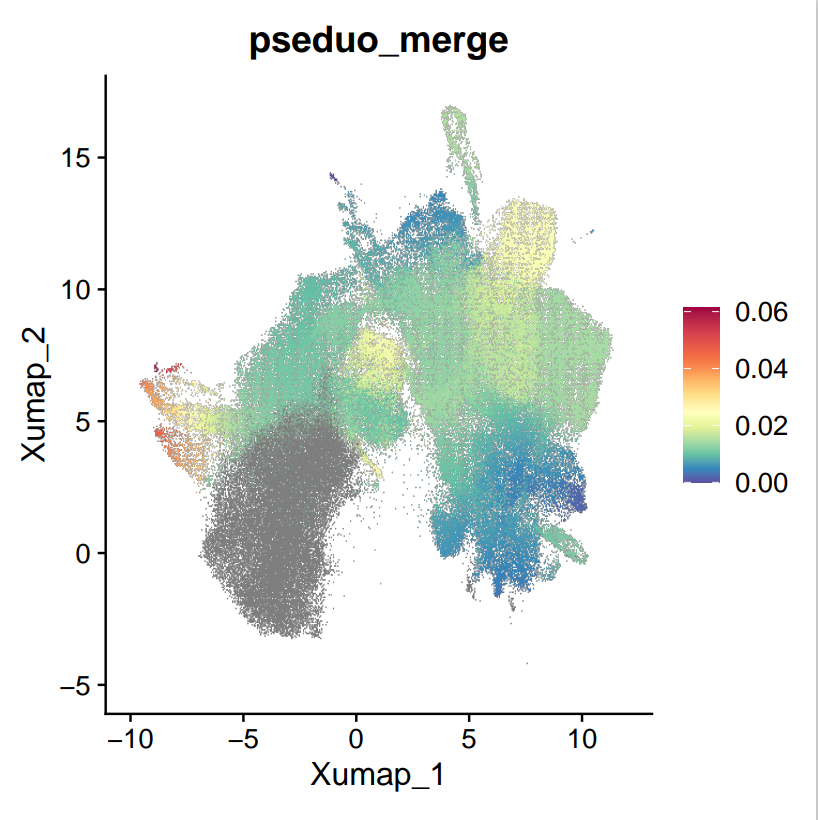
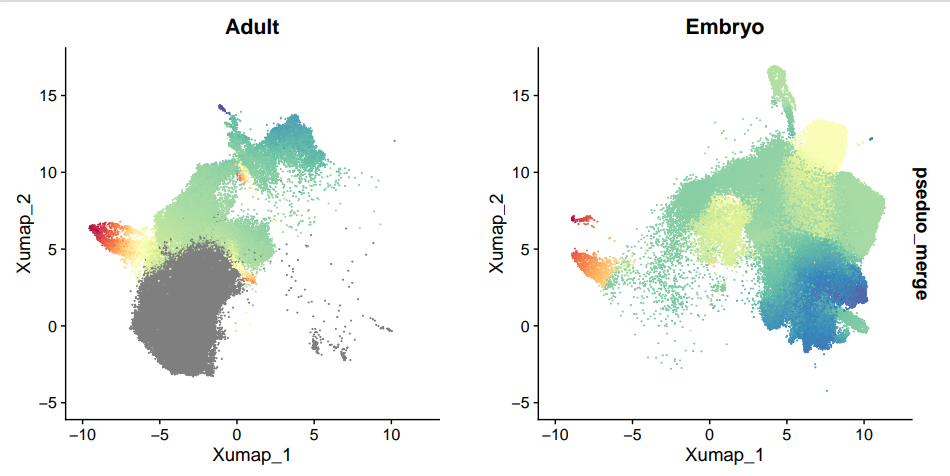

# Pseudotime Inference
## Introduction
Based on our previous analyses, we have identified two main developmental trajectories in tooth formation: one from bud mesenchyme to odontoblasts during embryonic development, and another from apical papilla to odontoblasts during postnatal and adult stages. To quantitatively characterize these developmental paths, we will employ Slingshot to infer pseudotime orderings along these trajectories.
## Slingshot
We use diffusion map as input for slingshot, as we can adjust the dimension of diffusion map to tune the results to align with biological insights.
And because the embryonic trajectory and postnatal trajectory have greate difference, we will apply slingshot to these two datasets separately.

```R
library(tidyverse)
library(slingshot)
library(ggplot2)
library(RColorBrewer)
library(Seurat)
load_mes_red <- read.csv("processed_data/framework/embedding/20241119_mes_diffmap_10.csv",row.names = 1)
load_mes_red_mat <- as.matrix(load_mes_red)
colnames(load_mes_red_mat) <- c(1:10)
diff_reduction <- CreateDimReducObject(embeddings = load_mes_red_mat,
                     key = "DM_", assay = DefaultAssay(mes),global = T)
mes@reductions$diffmap <- diff_reduction
mes_lineage <- slingshot(load_mes_red_mat[, c(2:10)],
                                     clusterLabels = factor(mes$C9_named),end.clus=c("Odontoblast"))
pseudo <- mes_lineage@assays@data$pseudotime
mes$pseudo <- pseudo[,1]
FeaturePlot(mes,"pseudo")+scale_colour_gradientn(colours = rev(brewer.pal(n = 11, name = "Spectral")),
                                                 values = c(0,0.4,0.55,0.65,1.0))
ggsave("results/trajectory/20241123_pseudotime/20241123_slingshot_psedudo1.pdf",width = 6,height = 6)

table(mes$Stage,mes$C9_named)
embryo <- mes$Stage%in%c("Embryo")

mes_lineage_embryo <- slingshot(load_mes_red_mat[embryo, c(2:10)],
                         clusterLabels = factor(mes$C9_named)[embryo],end.clus=c("Odontoblast"))
pseudo_embryo <- mes_lineage_embryo@assays@data$pseudotime
mes_lineage_postnatal <- slingshot(load_mes_red_mat[!embryo, c(2:10)],
                                clusterLabels = factor(mes$C9_named)[!embryo],end.clus=c("Odontoblast"))
mes_lineage_postnatal_2 <- slingshot(load_mes_red_mat[!embryo, c(2,4:5)],
                                   clusterLabels = factor(mes$C9_named)[!embryo],start.clus = "Cap Mes and follicle",end.clus=c("Odontoblast"))

mes_postnatal <- mes[,!embryo]
pseudo <- mes_lineage_postnatal_2@assays@data$pseudotime
mes_postnatal$pseudo2 <- pseudo[,2]
FeaturePlot(mes_postnatal,"pseudo2")+scale_colour_gradientn(colours = rev(brewer.pal(n = 11, name = "Spectral")),
                                                 values = c(0,0.4,0.55,0.65,1.0))


mes$pseduo_merge <- NA
mes$pseduo_merge[embryo] <- pseudo_embryo
mes$pseduo_merge[!embryo] <- pseudo[,2]
FeaturePlot(mes,"pseduo_merge")+scale_colour_gradientn(colours = rev(brewer.pal(n = 11, name = "Spectral")),
                                                 values = c(0,0.4,0.55,0.65,1.0))

```

## Result

